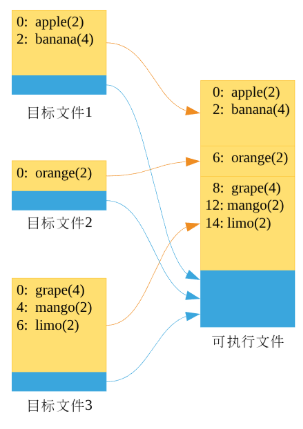
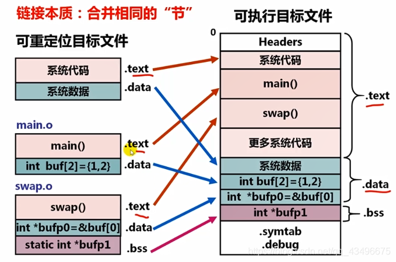

# c++ 编译原理浅析
Note: 记录个人实例探索的过程

## Pipeline
总体来讲，从我们写好的c++ 代码到最终生成可执行文件，一般需要经历一下几个过程

1. 预处理（Preprocessing）
预处理是对源代码文件进行初步的处理，g++ 编译器进行预处理的命令是 g++ -E ${src_file}, 预处理主要做了以下几件事:

     1. 将所有的#define删除，并且展开所有的宏定义，并且处理所有的条件预编译指令，比如#if #ifdef #elif #else #endif等。

     2. 处理#include预编译指令，将被包含的文件插入到该预编译指令的位置。

     3. 删除所有注释“//”和“/* */”。

     4. 添加行号和文件标识，以便编译时产生调试用的行号及编译错误警告行号。

     5. 保留所有的#pragma编译器指令，后续编译过程需要使用它们。

2. 编译（Compilation）
编译过程就是对预处理完的文件进行一系列的词法分析，语法分析，语义分析及优化后生成相应的汇编代码。g++ 编译器进行预处理的命令是 g++ -S ${src_file}
3. 汇编（Assembly）
汇编过程调用对汇编代码进行处理，生成处理器能识别的指令(也就是将汇编指令翻译为机器指令），保存在后缀为.o的目标文件中。由于每一个汇编语句几乎都对应一条处理器指令，因此，汇编相对于编译过程比较简单，通过调用Binutils中的汇编器as根据汇编指令和处理器指令的对照表一一翻译即可。g++ 编译器进行预处理的命令是 g++ -c ${src_file}
4. 链接（Linking）
链接过程是比较复杂的。汇编翻译得到的目标文件（object file， .o 文件)虽然已经是机器指令了，但是还是无法直接执行，因为目标文件中可能存在对其他函数或者类的依赖，而被依赖的对象没有在该文件中实现（比如我们写的代码依赖c++ 标准库，或者我们自己在别的cpp 文件中实现的函数）。所以本质上我们可以只写一个头文件就可以调用头文件中的函数写代码，可以正确的生成目标文件（.o)，在最后一步链接阶段才会报错。只要不进行连接，在编译和汇编阶段这种情况是不会报错的（当然，前提是你写代码是正确的include 了头文件，否则预处理就过不了）。 目标文件为那些找不到定义的符号记录了一张重定位表，在链接阶段，链接器会在静态链接库/动态链接库/其他目标文件中查找该符号的具体实现，并对该符号进行重定位，这样就可以找到该符号具体的实现了， 这样链接后的可执行文件就可以正常执行了。

## ELF文件介绍
因为后文需要，此处需要先介绍一下ELF（Executable LinkableFormat）文件格式，我们编译生成的目标文件（.o/.obj)，可执行文件都不是文本文件了，他们是一种叫ELF 的文件格式。这个格式的文件遵从一个叫COFF（Common File Format）的规范（Windows和Linux的可执行文件，甚至动态链接库都遵从这个规范）。ELF文件主要有三种:

  * 可重定位文件（relocatable file） 它保存了一些可以和其他目标文件链接并生成可执行文件或者共享库的二进制代码和数据。

  * 可执行文件（excutable file）它保存了适合直接加载到内存中执行的二进制程序。

  * 共享库文件（shared object file）一种特殊的可重定位目标文件，可以在加载或者运行时被动态的加载进内存并链接。

目标文件属于第一种，可执行文件属于第二种， 动态链接库属于第三种
ELF文件的结构，包含ELF的头部说明，然后是各种“段”（section），段是一个逻辑单元，会包含各种各样的信息，比如代码（.text）、数据（.data）、符号等。我们可以通过一些命令工具来查看ELF 文件信息。

1. file 命令, 可以查看文件的类型和基本信息（不仅可以查看ELF文件，也能查看更多的文件类型）

2. readelf 命令，非常强大的工具，可以查看elf 文件的各种信息：
     * readelf -h ${SRC_FILE} 可以查看elf 文件的Header 信息

     * readelf -S ${SRC_FILE} 可以查看elf 文件的section 信息

     * readelf -s ${SRC_FILE} 可以查看elf 文件的符号表信息

     * ......

4. objdump命令，基本功能和readelf 差不多，但是多了一个readelf 不具备的反汇编功能，命令 ```objdump -S ${SRC_FILE}``` 可以对特定文件反汇编，并显示机器指令对应的汇编代码, 命令 ```objdump -h ${SRC_FILE}``` 显示section 的Header 内容。

来看一些具体的例子(我已编译好一个可执行文件test了：
###### file 命令
```
file test.o
test.o: ELF 64-bit LSB relocatable, x86-64, version 1 (SYSV), not stripped
file test
test: ELF 64-bit LSB shared object, x86-64, version 1 (SYSV), dynamically linked, interpreter /lib64/l, for GNU/Linux 3.2.0, BuildID[sha1]=f59c5cf777ccdf9dddb7978f732275c0bd355489, not stripped
file test.cpp
test.cpp: C++ source, ASCII text
```
可以看到 test.o 和可执行文件test 都是ELF 格式文件。
###### ELF header 信息
```
readelf -h test
ELF Header:
  Magic:   7f 45 4c 46 02 01 01 00 00 00 00 00 00 00 00 00
  Class:                             ELF64
  Data:                              2's complement, little endian
  Version:                           1 (current)
  OS/ABI:                            UNIX - System V
  ABI Version:                       0
  Type:                              DYN (Shared object file)
  Machine:                           Advanced Micro Devices X86-64
  Version:                           0x1
  Entry point address:               0x780
  Start of program headers:          64 (bytes into file)
  Start of section headers:          7024 (bytes into file)
  Flags:                             0x0
  Size of this header:               64 (bytes)
  Size of program headers:           56 (bytes)
  Number of program headers:         9
  Size of section headers:           64 (bytes)
  Number of section headers:         29
  Section header string table index: 28
```
Header一个总的ELF的说明，里面包含是否可执行、目标硬件、操作系统等信息，还包含一个重要的“段表”，就是用来记录段（section）的信息,上面的Header 中还可以看到程序的入口地址是0x780，总共有29个section 等等信息。

###### ELF section 信息
先用 readelf 命令查看一下section 信息
```
 readelf -S test
There are 29 section headers, starting at offset 0x1b70:

Section Headers:
  [Nr] Name              Type             Address           Offset
       Size              EntSize          Flags  Link  Info  Align
  [ 0]                   NULL             0000000000000000  00000000
       0000000000000000  0000000000000000           0     0     0
  [ 1] .interp           PROGBITS         0000000000000238  00000238
       000000000000001c  0000000000000000   A       0     0     1
  [ 2] .note.ABI-tag     NOTE             0000000000000254  00000254
       0000000000000020  0000000000000000   A       0     0     4
  [ 3] .note.gnu.build-i NOTE             0000000000000274  00000274
       0000000000000024  0000000000000000   A       0     0     4
  [ 4] .gnu.hash         GNU_HASH         0000000000000298  00000298
       0000000000000024  0000000000000000   A       5     0     8
  [ 5] .dynsym           DYNSYM           00000000000002c0  000002c0
       0000000000000138  0000000000000018   A       6     1     8
  [ 6] .dynstr           STRTAB           00000000000003f8  000003f8
       0000000000000135  0000000000000000   A       0     0     1
  [ 7] .gnu.version      VERSYM           000000000000052e  0000052e
       000000000000001a  0000000000000002   A       5     0     2
  [ 8] .gnu.version_r    VERNEED          0000000000000548  00000548
       0000000000000040  0000000000000000   A       6     2     8
  [ 9] .rela.dyn         RELA             0000000000000588  00000588
       0000000000000120  0000000000000018   A       5     0     8
  [10] .rela.plt         RELA             00000000000006a8  000006a8
       0000000000000060  0000000000000018  AI       5    22     8
  [11] .init             PROGBITS         0000000000000708  00000708
       0000000000000017  0000000000000000  AX       0     0     4
  [12] .plt              PROGBITS         0000000000000720  00000720
       0000000000000050  0000000000000010  AX       0     0     16
  [13] .plt.got          PROGBITS         0000000000000770  00000770
       0000000000000008  0000000000000008  AX       0     0     8
  [14] .text             PROGBITS         0000000000000780  00000780
       0000000000000212  0000000000000000  AX       0     0     16
  [15] .fini             PROGBITS         0000000000000994  00000994
       0000000000000009  0000000000000000  AX       0     0     4
  [16] .rodata           PROGBITS         00000000000009a0  000009a0
       0000000000000005  0000000000000000   A       0     0     4
  [17] .eh_frame_hdr     PROGBITS         00000000000009a8  000009a8
       000000000000004c  0000000000000000   A       0     0     4
  [18] .eh_frame         PROGBITS         00000000000009f8  000009f8
       0000000000000148  0000000000000000   A       0     0     8
  [19] .init_array       INIT_ARRAY       0000000000200d78  00000d78
       0000000000000010  0000000000000008  WA       0     0     8
  [20] .fini_array       FINI_ARRAY       0000000000200d88  00000d88
       0000000000000008  0000000000000008  WA       0     0     8
  [21] .dynamic          DYNAMIC          0000000000200d90  00000d90
       0000000000000200  0000000000000010  WA       6     0     8
  [22] .got              PROGBITS         0000000000200f90  00000f90
       0000000000000070  0000000000000008  WA       0     0     8
  [23] .data             PROGBITS         0000000000201000  00001000
       0000000000000010  0000000000000000  WA       0     0     8
  [24] .bss              NOBITS           0000000000201020  00001010
       0000000000000118  0000000000000000  WA       0     0     32
  [25] .comment          PROGBITS         0000000000000000  00001010
       000000000000002b  0000000000000001  MS       0     0     1
  [26] .symtab           SYMTAB           0000000000000000  00001040
       00000000000006d8  0000000000000018          27    47     8
  [27] .strtab           STRTAB           0000000000000000  00001718
       0000000000000353  0000000000000000           0     0     1
  [28] .shstrtab         STRTAB           0000000000000000  00001a6b
       00000000000000fe  0000000000000000           0     0     1
Key to Flags:
  W (write), A (alloc), X (execute), M (merge), S (strings), I (info),
  L (link order), O (extra OS processing required), G (group), T (TLS),
  C (compressed), x (unknown), o (OS specific), E (exclude),
```
我们看到了总共有29个section, 一些section的含义如下：

* .code(或者叫.text):代码段，存放代码
* .data：数据段，放全局变量和局部静态变量
* .bss：为未初始化的全局变量和局部静态变量预留位置，不占空间
* .strtab : String Table 字符串表，用于存储 ELF 文件中用到的各种字符串。
* .symtab : Symbol Table 符号表，从这里可以所以文件中的各个符号。
* .shstrtab : 是各个段的名称表，实际上是由各个段的名字组成的一个字符串数组。
* .hash : 符号哈希表。
* .line : 调试时的行号表，即源代码行号与编译后指令的对应表。
* .dynamic : 动态链接信息。
* .debug : 调试信息。
* .comment : 存放编译器版本信息，比如 "GCC:(GNU)4.2.0"。
* .plt 和 .got : 动态链接的跳转表和全局入口表。
* .init 和 .fini : 程序初始化和终结代码段。
* .rodata1 : Read Only Data，只读数据段，存放字符串常量，全局 const 变量，该段和 .rodata 一样。

注意看Address 一列，表示的是这个section 的地址（当然都是虚拟内存地址），我们再用objdump 来看一下section 信息
```
objdump -h test

test:     file format elf64-x86-64

Sections:
Idx Name          Size      VMA               LMA               File off  Algn
  0 .interp       0000001c  0000000000000238  0000000000000238  00000238  2**0
                  CONTENTS, ALLOC, LOAD, READONLY, DATA
  1 .note.ABI-tag 00000020  0000000000000254  0000000000000254  00000254  2**2
                  CONTENTS, ALLOC, LOAD, READONLY, DATA
  2 .note.gnu.build-id 00000024  0000000000000274  0000000000000274  00000274  2**2
                  CONTENTS, ALLOC, LOAD, READONLY, DATA
  3 .gnu.hash     00000024  0000000000000298  0000000000000298  00000298  2**3
                  CONTENTS, ALLOC, LOAD, READONLY, DATA
  4 .dynsym       00000138  00000000000002c0  00000000000002c0  000002c0  2**3
                  CONTENTS, ALLOC, LOAD, READONLY, DATA
  5 .dynstr       00000135  00000000000003f8  00000000000003f8  000003f8  2**0
                  CONTENTS, ALLOC, LOAD, READONLY, DATA
  6 .gnu.version  0000001a  000000000000052e  000000000000052e  0000052e  2**1
                  CONTENTS, ALLOC, LOAD, READONLY, DATA
  7 .gnu.version_r 00000040  0000000000000548  0000000000000548  00000548  2**3
                  CONTENTS, ALLOC, LOAD, READONLY, DATA
  8 .rela.dyn     00000120  0000000000000588  0000000000000588  00000588  2**3
                  CONTENTS, ALLOC, LOAD, READONLY, DATA
  9 .rela.plt     00000060  00000000000006a8  00000000000006a8  000006a8  2**3
                  CONTENTS, ALLOC, LOAD, READONLY, DATA
 10 .init         00000017  0000000000000708  0000000000000708  00000708  2**2
                  CONTENTS, ALLOC, LOAD, READONLY, CODE
 11 .plt          00000050  0000000000000720  0000000000000720  00000720  2**4
                  CONTENTS, ALLOC, LOAD, READONLY, CODE
 12 .plt.got      00000008  0000000000000770  0000000000000770  00000770  2**3
                  CONTENTS, ALLOC, LOAD, READONLY, CODE
 13 .text         00000212  0000000000000780  0000000000000780  00000780  2**4
                  CONTENTS, ALLOC, LOAD, READONLY, CODE
 14 .fini         00000009  0000000000000994  0000000000000994  00000994  2**2
                  CONTENTS, ALLOC, LOAD, READONLY, CODE
 15 .rodata       00000005  00000000000009a0  00000000000009a0  000009a0  2**2
                  CONTENTS, ALLOC, LOAD, READONLY, DATA
 16 .eh_frame_hdr 0000004c  00000000000009a8  00000000000009a8  000009a8  2**2
                  CONTENTS, ALLOC, LOAD, READONLY, DATA
 17 .eh_frame     00000148  00000000000009f8  00000000000009f8  000009f8  2**3
                  CONTENTS, ALLOC, LOAD, READONLY, DATA
 18 .init_array   00000010  0000000000200d78  0000000000200d78  00000d78  2**3
                  CONTENTS, ALLOC, LOAD, DATA
 19 .fini_array   00000008  0000000000200d88  0000000000200d88  00000d88  2**3
                  CONTENTS, ALLOC, LOAD, DATA
 20 .dynamic      00000200  0000000000200d90  0000000000200d90  00000d90  2**3
                  CONTENTS, ALLOC, LOAD, DATA
 21 .got          00000070  0000000000200f90  0000000000200f90  00000f90  2**3
                  CONTENTS, ALLOC, LOAD, DATA
 22 .data         00000010  0000000000201000  0000000000201000  00001000  2**3
                  CONTENTS, ALLOC, LOAD, DATA
 23 .bss          00000118  0000000000201020  0000000000201020  00001010  2**5
                  ALLOC
 24 .comment      0000002b  0000000000000000  0000000000000000  00001010  2**0
                  CONTENTS, READONLY

```
objdump 的section 少显示了五个，就是readelf 26-28 号的section以及readelf 的0号section(这个section), objdump 中输出的VMA 对应 readelf 中的Address, 都表示该段的地址。
###### ELF 符号表
再来看一下ELF 文件的符号表, 符号表表示了各个函数、变量的名字对应的代码或者内存地址
```
readelf -s test

Symbol table '.dynsym' contains 13 entries:
   Num:    Value          Size Type    Bind   Vis      Ndx Name
     0: 0000000000000000     0 NOTYPE  LOCAL  DEFAULT  UND
     1: 0000000000000000     0 FUNC    WEAK   DEFAULT  UND __cxa_finalize@GLIBC_2.2.5 (2)
     2: 0000000000000000     0 FUNC    GLOBAL DEFAULT  UND _ZSt4endlIcSt11char_trait@GLIBCXX_3.4 (3)
     3: 0000000000000000     0 FUNC    GLOBAL DEFAULT  UND __cxa_atexit@GLIBC_2.2.5 (2)
     4: 0000000000000000     0 FUNC    GLOBAL DEFAULT  UND _ZNSolsEPFRSoS_E@GLIBCXX_3.4 (3)
     5: 0000000000000000     0 FUNC    GLOBAL DEFAULT  UND _ZNSt8ios_base4InitC1Ev@GLIBCXX_3.4 (3)
     6: 0000000000000000     0 FUNC    GLOBAL DEFAULT  UND _ZNSolsEi@GLIBCXX_3.4 (3)
     7: 0000000000000000     0 NOTYPE  WEAK   DEFAULT  UND _ITM_deregisterTMCloneTab
     8: 0000000000000000     0 FUNC    GLOBAL DEFAULT  UND __libc_start_main@GLIBC_2.2.5 (2)
     9: 0000000000000000     0 NOTYPE  WEAK   DEFAULT  UND __gmon_start__
    10: 0000000000000000     0 NOTYPE  WEAK   DEFAULT  UND _ITM_registerTMCloneTable
    11: 0000000000000000     0 FUNC    GLOBAL DEFAULT  UND _ZNSt8ios_base4InitD1Ev@GLIBCXX_3.4 (3)
    12: 0000000000201020   272 OBJECT  GLOBAL DEFAULT   24 _ZSt4cout@GLIBCXX_3.4 (3)

Symbol table '.symtab' contains 73 entries:
   Num:    Value          Size Type    Bind   Vis      Ndx Name
     0: 0000000000000000     0 NOTYPE  LOCAL  DEFAULT  UND
     1: 0000000000000238     0 SECTION LOCAL  DEFAULT    1
     2: 0000000000000254     0 SECTION LOCAL  DEFAULT    2
     3: 0000000000000274     0 SECTION LOCAL  DEFAULT    3
     4: 0000000000000298     0 SECTION LOCAL  DEFAULT    4
     5: 00000000000002c0     0 SECTION LOCAL  DEFAULT    5
     6: 00000000000003f8     0 SECTION LOCAL  DEFAULT    6
     7: 000000000000052e     0 SECTION LOCAL  DEFAULT    7
     8: 0000000000000548     0 SECTION LOCAL  DEFAULT    8
     9: 0000000000000588     0 SECTION LOCAL  DEFAULT    9
    10: 00000000000006a8     0 SECTION LOCAL  DEFAULT   10
    11: 0000000000000708     0 SECTION LOCAL  DEFAULT   11
    12: 0000000000000720     0 SECTION LOCAL  DEFAULT   12
    13: 0000000000000770     0 SECTION LOCAL  DEFAULT   13
    14: 0000000000000780     0 SECTION LOCAL  DEFAULT   14
    15: 0000000000000994     0 SECTION LOCAL  DEFAULT   15
    16: 00000000000009a0     0 SECTION LOCAL  DEFAULT   16
    17: 00000000000009a8     0 SECTION LOCAL  DEFAULT   17
    18: 00000000000009f8     0 SECTION LOCAL  DEFAULT   18
    19: 0000000000200d78     0 SECTION LOCAL  DEFAULT   19
    20: 0000000000200d88     0 SECTION LOCAL  DEFAULT   20
    21: 0000000000200d90     0 SECTION LOCAL  DEFAULT   21
    22: 0000000000200f90     0 SECTION LOCAL  DEFAULT   22
    23: 0000000000201000     0 SECTION LOCAL  DEFAULT   23
    24: 0000000000201020     0 SECTION LOCAL  DEFAULT   24
    25: 0000000000000000     0 SECTION LOCAL  DEFAULT   25
    26: 0000000000000000     0 FILE    LOCAL  DEFAULT  ABS crtstuff.c
    27: 00000000000007b0     0 FUNC    LOCAL  DEFAULT   14 deregister_tm_clones
    28: 00000000000007f0     0 FUNC    LOCAL  DEFAULT   14 register_tm_clones
    29: 0000000000000840     0 FUNC    LOCAL  DEFAULT   14 __do_global_dtors_aux
    30: 0000000000201130     1 OBJECT  LOCAL  DEFAULT   24 completed.7697
    31: 0000000000200d88     0 OBJECT  LOCAL  DEFAULT   20 __do_global_dtors_aux_fin
    32: 0000000000000880     0 FUNC    LOCAL  DEFAULT   14 frame_dummy
    33: 0000000000200d78     0 OBJECT  LOCAL  DEFAULT   19 __frame_dummy_init_array_
    34: 0000000000000000     0 FILE    LOCAL  DEFAULT  ABS test.cpp
    35: 00000000000009a4     1 OBJECT  LOCAL  DEFAULT   16 _ZStL19piecewise_construc
    36: 0000000000201131     1 OBJECT  LOCAL  DEFAULT   24 _ZStL8__ioinit
    37: 00000000000008bb    73 FUNC    LOCAL  DEFAULT   14 _Z41__static_initializati
    38: 0000000000000904    21 FUNC    LOCAL  DEFAULT   14 _GLOBAL__sub_I_main
    39: 0000000000000000     0 FILE    LOCAL  DEFAULT  ABS crtstuff.c
    40: 0000000000000b3c     0 OBJECT  LOCAL  DEFAULT   18 __FRAME_END__
    41: 0000000000000000     0 FILE    LOCAL  DEFAULT  ABS
    42: 00000000000009a8     0 NOTYPE  LOCAL  DEFAULT   17 __GNU_EH_FRAME_HDR
    43: 0000000000200d90     0 OBJECT  LOCAL  DEFAULT   21 _DYNAMIC
    44: 0000000000200d88     0 NOTYPE  LOCAL  DEFAULT   19 __init_array_end
    45: 0000000000200d78     0 NOTYPE  LOCAL  DEFAULT   19 __init_array_start
    46: 0000000000200f90     0 OBJECT  LOCAL  DEFAULT   22 _GLOBAL_OFFSET_TABLE_
    47: 0000000000201010     0 NOTYPE  GLOBAL DEFAULT   23 _edata
    48: 0000000000201000     0 NOTYPE  WEAK   DEFAULT   23 data_start
    49: 00000000000009a0     4 OBJECT  GLOBAL DEFAULT   16 _IO_stdin_used
    50: 0000000000000000     0 FUNC    WEAK   DEFAULT  UND __cxa_finalize@@GLIBC_2.2
    51: 000000000000088a    49 FUNC    GLOBAL DEFAULT   14 main
    52: 0000000000000000     0 FUNC    GLOBAL DEFAULT  UND _ZSt4endlIcSt11char_trait
    53: 0000000000201008     0 OBJECT  GLOBAL HIDDEN    23 __dso_handle
    54: 0000000000000994     0 FUNC    GLOBAL DEFAULT   15 _fini
    55: 0000000000000000     0 FUNC    GLOBAL DEFAULT  UND __cxa_atexit@@GLIBC_2.2.5
    56: 0000000000000780    43 FUNC    GLOBAL DEFAULT   14 _start
    57: 0000000000000000     0 FUNC    GLOBAL DEFAULT  UND _ZNSolsEPFRSoS_E@@GLIBCXX
    58: 0000000000000708     0 FUNC    GLOBAL DEFAULT   11 _init
    59: 0000000000201010     0 OBJECT  GLOBAL HIDDEN    23 __TMC_END__
    60: 0000000000201020   272 OBJECT  GLOBAL DEFAULT   24 _ZSt4cout@@GLIBCXX_3.4
    61: 0000000000201000     0 NOTYPE  GLOBAL DEFAULT   23 __data_start
    62: 0000000000201138     0 NOTYPE  GLOBAL DEFAULT   24 _end
    63: 0000000000201010     0 NOTYPE  GLOBAL DEFAULT   24 __bss_start
    64: 0000000000000000     0 FUNC    GLOBAL DEFAULT  UND _ZNSt8ios_base4InitC1Ev@@
    65: 0000000000000920   101 FUNC    GLOBAL DEFAULT   14 __libc_csu_init
    66: 0000000000000000     0 FUNC    GLOBAL DEFAULT  UND _ZNSolsEi@@GLIBCXX_3.4
    67: 0000000000000000     0 NOTYPE  WEAK   DEFAULT  UND _ITM_deregisterTMCloneTab
    68: 0000000000000990     2 FUNC    GLOBAL DEFAULT   14 __libc_csu_fini
    69: 0000000000000000     0 FUNC    GLOBAL DEFAULT  UND __libc_start_main@@GLIBC_
    70: 0000000000000000     0 NOTYPE  WEAK   DEFAULT  UND __gmon_start__
    71: 0000000000000000     0 NOTYPE  WEAK   DEFAULT  UND _ITM_registerTMCloneTable
``` 
可以看到在.dynsyn 和.dyntab 中读到了符号表，最后一列是符号名称，Ndx 是符号所在的section 的index, Value 对应了符号的地址。可以看到 main 对应的Ndx 是14， value 是 88a, 表示 main 在.text section(代码段嘛这不是，翻前面的section 信息可以看到14号是.text), 对应的地址是88a。
## 举第一个栗子
有了ELF文件的知识我们就可以愉快的开始做实验了
### cpp文件
首先编写test.cpp 文件，内容如下
```
#include<iostream>
using namespace std;
int main(){
    cout<<1<<endl;
    return 0;
}
```
### 预处理文件
执行 ``` g++ -E test.cpp -o test.i ``` 进行预处理，-o 指定了输出文件名（后文中都是如此）， 可以看到 test.i 中所有的头文件都被展开，文件相比test.cpp 大很多，此时test.i 依然是个文本文件，test.i 内容如下：
```
 # 1 "test.cpp"
 # 1 "<built-in>"
 # 1 "<command-line>"
 # 1 "/usr/include/stdc-predef.h" 1 3 4
 # 1 "<command-line>" 2
 # 1 "test.cpp"
 # 1 "/usr/include/c++/7/iostream" 1 3
 # 36 "/usr/include/c++/7/iostream" 3

 # 37 "/usr/include/c++/7/iostream" 3

 # 1 "/usr/include/x86_64-linux-gnu/c++/7/bits/c++config.h" 1 3
 # 229 "/usr/include/x86_64-linux-gnu/c++/7/bits/c++config.h" 3

 # 229 "/usr/include/x86_64-linux-gnu/c++/7/bits/c++config.h" 3
 namespace std
 {
   typedef long unsigned int size_t;
   typedef long int ptrdiff_t;


   typedef decltype(nullptr) nullptr_t;

 }
 # 251 "/usr/include/x86_64-linux-gnu/c++/7/bits/c++config.h" 3
 namespace std
 ... 后面还很长，此处省略
```
###汇编文件
执行```g++ -S test.i -o test.s``` 得到编译后的代码，此时代码已经被翻译为汇编代码, 文件类型依然是文本文件，内容如下：
```
     .file   "test.cpp"
     .text
     .section    .rodata
     .type   _ZStL19piecewise_construct, @object
     .size   _ZStL19piecewise_construct, 1
 _ZStL19piecewise_construct:
     .zero   1
     .local  _ZStL8__ioinit
     .comm   _ZStL8__ioinit,1,1
     .text
     .globl  main
     .type   main, @function
 main:
 .LFB1493:
     .cfi_startproc
     pushq   %rbp
     .cfi_def_cfa_offset 16
     .cfi_offset 6, -16
     movq    %rsp, %rbp
     .cfi_def_cfa_register 6
     movl    $1, %esi
     leaq    _ZSt4cout(%rip), %rdi
     call    _ZNSolsEi@PLT
     movq    %rax, %rdx
     movq    _ZSt4endlIcSt11char_traitsIcEERSt13basic_ostreamIT_T0_ES6_@GOTPCREL(%rip), %rax
     movq    %rax, %rsi
     ... 后面还很长，此处省略
```
### 目标文件
执行 ```g++ -c test.s -o test.o``` 对汇编代码进行汇编（麻蛋，这个翻译真蛋疼,第二个指的是汇编的动作）， 这一步输出的文件已经是目标文件（object file)了, 一般以.o 结尾，此时文件的格式已经不再是文本文件了，因为汇编的过程将汇编代码翻译成了机器指令, 最终生成了一个目标文件， 文件类型是ELF文件.
```
readelf -h test.o
ELF Header:
  Magic:   7f 45 4c 46 02 01 01 00 00 00 00 00 00 00 00 00
  Class:                             ELF64
  Data:                              2's complement, little endian
  Version:                           1 (current)
  OS/ABI:                            UNIX - System V
  ABI Version:                       0
  Type:                              REL (Relocatable file)
  Machine:                           Advanced Micro Devices X86-64
  Version:                           0x1
  Entry point address:               0x0
  Start of program headers:          0 (bytes into file)
  Start of section headers:          1728 (bytes into file)
  Flags:                             0x0
  Size of this header:               64 (bytes)
  Size of program headers:           0 (bytes)
  Number of program headers:         0
  Size of section headers:           64 (bytes)
  Number of section headers:         15
  Section header string table index: 14

```

至此，可以看到此时目标文件已经是ELF 格式的可重定向文件了。
### 可执行文件
下面就是最后一步链接生成可执行文件了，运行 ``` g++ test.o -o test``` 会完成链接，生成真正的可执行文件test， 此时在命令行中输入```./test```会打印1到终端。可执行文件也是ELF 文件，因此查看方法与目标文件相同
```
readelf -h test
ELF Header:
  Magic:   7f 45 4c 46 02 01 01 00 00 00 00 00 00 00 00 00
  Class:                             ELF64
  Data:                              2's complement, little endian
  Version:                           1 (current)
  OS/ABI:                            UNIX - System V
  ABI Version:                       0
  Type:                              DYN (Shared object file)
  Machine:                           Advanced Micro Devices X86-64
  Version:                           0x1
  Entry point address:               0x780
  Start of program headers:          64 (bytes into file)
  Start of section headers:          7024 (bytes into file)
  Flags:                             0x0
  Size of this header:               64 (bytes)
  Size of program headers:           56 (bytes)
  Number of program headers:         9
  Size of section headers:           64 (bytes)
  Number of section headers:         29
  Section header string table index: 28
```
好，到此，第一个栗子打完收工，我们走完了cpp 到可执行文件的整个流程。

## 深入链接细节
### 动态链接 vs 静态链接 初探
在第一个栗子中我们生成了一个可执行文件test, 我们提到链接的时候会对代码中依赖的函数（或者类，变量等）进行连接（比如我们依赖了cout函数），具体来说就是找到被依赖对象的具体实现，并将这些指令编入当前可执行文件中，对，大概是这么个意思。但具体链接的时候有两种链接方式：静态链接vs动态链接：

   * 静态链接：在生成可执行文件的时候(链接阶段)，把所有需要的函数(类，变量等）的二进制代码都包含到可执行文件中去
   * 动态链接：在编译的时候不直接拷贝可执行代码，而是通过记录一系列符号和参数，在程序运行或加载时将这些信息传递给操作系统，操作系统负责将需要的动态库加载到内存中，然后程序在运行到指定的代码时，去共享执行内存中已经加载的动态库可执行代码，最终达到运行时连接的目的。

显而易见，静态链接的可执行文件会大，因为其中拷贝了依赖对象的二进制代码，而动态链接只是记录了依赖对象的相关meta信息，二进制代码是在运行阶段动态加载的。这就产生了两个特点：

  * 静态链接产生的可执行文件不需要依赖任何库就可以运行，因为其自身包含了其需要的所有二进制代码
  * 动态链接产生的可执行文件运行依赖于其依赖的动态链接库，如果在运行时操作系统找不到其依赖的动态链接库，则程序会报错

我们先看看我们再第一个栗子中生成的可执行文件test是动态链接的还是静态链接的，ldd 命令可以查看可执行文件依赖的动态库,我们看一下test 的依赖
```
ldd test
        linux-vdso.so.1 (0x00007fff363c5000)
        libstdc++.so.6 => /usr/lib/x86_64-linux-gnu/libstdc++.so.6 (0x00007fe19371f000)
        libc.so.6 => /lib/x86_64-linux-gnu/libc.so.6 (0x00007fe19332e000)
        libm.so.6 => /lib/x86_64-linux-gnu/libm.so.6 (0x00007fe192f90000)
        /lib64/ld-linux-x86-64.so.2 (0x00007fe193caa000)
        libgcc_s.so.1 => /lib/x86_64-linux-gnu/libgcc_s.so.1 (0x00007fe192d78000)
```
看起来g++ 默认动态链接，如果尝试删掉依赖的任何个so 文件，程序运行都会报错（不过这个例子中给出的so 文件不要尝试删除，删除会使得系统无法使用，因为这些依赖都是非常基础的，整个系统很多功能都在依赖）
那能不能编成静态编译的可执行文件呢，这样运行就没有这么多依赖，直接拷贝到任何地方都可以运行，答案是可以， 只需要在编译时加 -static 参数，就会采用静态链接。还是第一个栗子中的代码，我们执行```g++ -static test.cpp -o static_test```可以生成可执行文件 static_test, 来看一下文件大小：
```
ll
total 2.9M
-rwxrwxr-x 1 menxin menxin 2.2M Jan 17 20:05 static_test
-rwxrwxr-x 1 menxin menxin 8.7K Jan 17 19:45 test
-rw-rw-r-- 1 menxin menxin   85 Jan 17 19:42 test.cpp
-rw-rw-r-- 1 menxin menxin 651K Jan 17 18:03 test.i
-rw-rw-r-- 1 menxin menxin 2.7K Jan 17 12:04 test.o
-rw-rw-r-- 1 menxin menxin 2.0K Jan 17 18:06 test.s
```
再看一下ELF 文件头
```
readelf -h static_test
ELF Header:
  Magic:   7f 45 4c 46 02 01 01 03 00 00 00 00 00 00 00 00
  Class:                             ELF64
  Data:                              2's complement, little endian
  Version:                           1 (current)
  OS/ABI:                            UNIX - GNU
  ABI Version:                       0
  Type:                              EXEC (Executable file)
  Machine:                           Advanced Micro Devices X86-64
  Version:                           0x1
  Entry point address:               0x400ea0
  Start of program headers:          64 (bytes into file)
  Start of section headers:          2248552 (bytes into file)
  Flags:                             0x0
  Size of this header:               64 (bytes)
  Size of program headers:           56 (bytes)
  Number of program headers:         6
  Size of section headers:           64 (bytes)
  Number of section headers:         33
  Section header string table index: 32

```
可以看到Type 变成了 EXEC 这个与动态链接得到的可执行文件不同，另外 entry point address 也变了， 有兴趣的可以反汇编一下static_test 会发现反汇编得到的代码要比 test 多很多。查看static_test依赖的库会得到如下输出
```
 ldd static_test
        not a dynamic executable
```
动态链接和静态链接各有优缺点，静态链接的好处是程序不需要依赖库，可以独立运行。缺点是体积大，静态库更新的时候需要重新编译可执行文件
动态库的好处是可执行文件体积小，节约内存（因为不同可执行依赖的相同库，在内存中只会存在一份），而且可以方便的实现代码共享和升级（不需要重新编译可执行文件），缺点是程序无法独立运行，必须伴随依赖库一起发布，依赖官方库的程序一般不需要一起发布官方库，因为一般机器上都有这些依赖，另外一个缺点是在运行时加载的机制会影响代码执行的性能。

## 如何发布静态库
静态库本质是一系列.o文件集合的压缩包，一般以.a 结尾， 比如libc.a, 可以通过命令 ar -t ${FILE} 来查看静态链接库中包含的目标文件，在我的机器上执行可以看到如下输出(文件太多，列出一部分，其中有我们熟悉的print.o
```
ar -t /usr/lib/x86_64-linux-gnu/libc.a | grep -E "^print.*"
printf_fp.o
printf-prs.o
printf_fphex.o
printf_size.o
printf.o
printf-parsemb.o
printf-parsewc.o
printf_chk.o
```
所以发布静态库，其实只需要将我们编译得到的目标文件打包即可发布，供其他人链接使用，当然，需要发布头文件，不过头文件不重要，如果用户知道你的API 完全可以自己写一个头文件使用。需要注意的是静态链接库的命名是有规范的lib${LIB_NAME}.a, 需要遵循这个规范，否则编译器在链接的时候可能会找不到。

## 如何发布动态库
动态库发布比静态库要稍微复杂一些，需要给g++ 编译器传特定的参数 -shared, 这个参数告诉编译器编译动态链接库。另外要加上参数 -fPIC 这个参数告诉编译器生成位置无关码(PIC: Position Independent code)，位置无关码确保程序可以在运行期间来动态确定动态库的地址（核心思想其实是：将需要改动的代码段放到了数据段，引入了GOT/PLT）编译器会生成GOT和PLT。如果你的库里面没有任何的外部依赖，那么你就可以不用加fPIC, 因为你的库不依赖任何的库那么就不存在动态链接别的库的问题。
## 举二个栗子
举一个动态库的栗子, 有如下三个文件：

utils.h
```
int add(int x, int y);
int sub(int x, int y);
```
add.cpp
```
#include "utils.h"
int add(int x, int y){
     int c = x + y;
     return c;
 }
```
sub.cpp
```
int sub_var = 1;
#include "utils.h"
int sub(int x, int y){
     int c = x - y;
     return c;
 }
```
main.cpp
```
#include <iostream>
#include "utils.h"

using namespace std;
int main_var = 1;
int main(){
   int x = 1;
   int y = 2;
   int c = add(x, y);
   cout<<c<<endl;
   c = sub(x, y);
   cout<<c<<endl;
   return 0;
}
```
先执行代码```g++ -shared add.cpp -o libadd.so``` 生成共享链接库
再执行代码```g++ main.cpp sub.cpp -L. -ladd -o main``` 来编译main.cpp，其中-L -l 参数时告诉链接器在哪个目录下找哪个链接库，如果不设置的话执行```g++ main.cpp sub.cpp -o main``` 会报错如下:
```
g++ main.cpp sub.cpp -o main
/tmp/cc6lFDpb.o: In function `main':
main.cpp:(.text+0x21): undefined reference to `add(int, int)'
collect2: error: ld returned 1 exit status
```
此时运行```./main```程序会报错, ldd 查看发现确实依赖了libadd.so

```
./main
./main: error while loading shared libraries: libadd.so: cannot open shared object file: No such file or directory
ldd main
        linux-vdso.so.1 (0x00007ffedfd50000)
        libadd.so (0x00007f3323ffa000)
        libstdc++.so.6 => /usr/lib/x86_64-linux-gnu/libstdc++.so.6 (0x00007f3323c71000)
        libc.so.6 => /lib/x86_64-linux-gnu/libc.so.6 (0x00007f3323880000)
        libm.so.6 => /lib/x86_64-linux-gnu/libm.so.6 (0x00007f33234e2000)
        /lib64/ld-linux-x86-64.so.2 (0x00007f33243ff000)
        libgcc_s.so.1 => /lib/x86_64-linux-gnu/libgcc_s.so.1 (0x00007f33232ca000)
```
这是因为程序运行时找不到add库，设置``` export LD_LIBRARY_PATH=$LD_LIBRARY_PATH:${YOUR_LIB_DIR}```   设置动态链接路径，则可以正常运行得到结果,

## 链接算法再探
### 链接算法流程
整体来看链接过程做了一件事情，就是将目标文件，动态库，静态库链接起来，生成了一个可执行文件，细分来看，可以看做做了两个事情：

  1. 将所有目标文件合并为1个可执行文件
  2. 链接过程对外部依赖的对象进行了重定位

链接器的工作流程如下描述：

1. 链接器从左到右按照命令行出现顺序扫描目标文件和静态库

2. 链接器维护一个目标文件的集合E，一个未解析符号集合U，以及E中已定义的符号集合D，初始状态E、U、D都为空

3. 对命令行上每个文件f，链接器会判断f是否是一个目标文件还是静态库，如果是目标文件，则f加入到E，f中未定义的符号加入到U中，已定义符号加入到D中，继续下一文件

4. 如果是静态库，链接器尝试到静态库目标文件中匹配U中未定义的符号，如果m中匹配U中的一个符号，那么m就和上步中文件f一样处理，对每个成员文件都依次处理，直到U、D无变化，不包含在E中的成员文件简单丢弃

5. 所有输入文件处理完后，如果U中还有符号，则报错
6. 如果前面5步都没有出错，那么开始合并E中所有目标文件的section, 将所有的代码段/数据段等等合成一个代码段数据段
如下图(黄色是数据段，蓝色是代码段）：

7. 对D中定义的符号重定位（确定在新的section中所有定义符号在虚拟地址空间中的地址）
8. 对引用符号重定位（修改.text、.data节中对每个符号的引用，需要用到.rel_data、.rel_text中保存的重定位信息）
9. 所有section 合并完成，且所有引用符号都重定位后，文件格式已经是ELF，且可以正常运行，就是最后的可执行文件了。

### 重定位
链接之前目标文件里面的符号地址都是相对于每个目标文件的基地址的，链接之后合成了一个可执行文件，那么显然所有符号的地址都变了，对这些符号的引用也需要修改（想象：函数名对应的函数地址变了， 所有调用函数的地方调用的地址也应该相应修改）。编译完的目标文件，其实里面的变量地址、函数地址，基准地址，都是0，也就是啥都是0地址开始的。我们可以知道他们每个符号的偏移offset的，因为合并的过程知识顺序合并了各个目标文件相应的section这样的话，编译器可以获得合并之后新的基地址，加上符号对应的offset，就可以得到新的地址。把所有涉及到符号被调用的地方，都改一下，就完成了这个重定位的过程。

那这个重定位到底是怎样实现的呢？是通过重定位表 + 符号表来完成的， 这两个表都在目标文件中可以通过```readelf -r ${YOUR_FILE}```查看重定位表，通过```readelf -s ${YOUR_FILE}```查看符号表。

### 重定位表
当目标文件中引用了外部的符号时，会出现在重定位表中， 告诉编译器此处的地址会在未来被修改，因为当前不知道符号的具体实现，当然也不知道其对应的地址。我们来看一下第二个例子中main.o 的重定位表
```
readelf -r main.o

Relocation section '.rela.text' at offset 0x5c8 contains 16 entries:
  Offset          Info           Type           Sym. Value    Sym. Name + Addend
000000000021  001100000004 R_X86_64_PLT32    0000000000000000 _Z3addii - 4
000000000030  001200000002 R_X86_64_PC32     0000000000000000 _ZSt4cout - 4
000000000035  001300000004 R_X86_64_PLT32    0000000000000000 _ZNSolsEi - 4
00000000003f  00140000002a R_X86_64_REX_GOTP 0000000000000000 _ZSt4endlIcSt11char_tr - 4
00000000004a  001500000004 R_X86_64_PLT32    0000000000000000 _ZNSolsEPFRSoS_E - 4
000000000059  001600000004 R_X86_64_PLT32    0000000000000000 _Z3subii - 4
000000000068  001200000002 R_X86_64_PC32     0000000000000000 _ZSt4cout - 4
00000000006d  001300000004 R_X86_64_PLT32    0000000000000000 _ZNSolsEi - 4
000000000077  00140000002a R_X86_64_REX_GOTP 0000000000000000 _ZSt4endlIcSt11char_tr - 4
000000000082  001500000004 R_X86_64_PLT32    0000000000000000 _ZNSolsEPFRSoS_E - 4
0000000000ad  000400000002 R_X86_64_PC32     0000000000000000 .bss - 4
0000000000b2  001700000004 R_X86_64_PLT32    0000000000000000 _ZNSt8ios_base4InitC1E - 4
0000000000b9  001800000002 R_X86_64_PC32     0000000000000000 __dso_handle - 4
0000000000c0  000400000002 R_X86_64_PC32     0000000000000000 .bss - 4
0000000000c7  00190000002a R_X86_64_REX_GOTP 0000000000000000 _ZNSt8ios_base4InitD1E - 4
0000000000cf  001a00000004 R_X86_64_PLT32    0000000000000000 __cxa_atexit - 4

Relocation section '.rela.init_array' at offset 0x748 contains 1 entry:
  Offset          Info           Type           Sym. Value    Sym. Name + Addend
000000000000  000200000001 R_X86_64_64       0000000000000000 .text + d6

Relocation section '.rela.eh_frame' at offset 0x760 contains 3 entries:
  Offset          Info           Type           Sym. Value    Sym. Name + Addend
000000000020  000200000002 R_X86_64_PC32     0000000000000000 .text + 0
000000000040  000200000002 R_X86_64_PC32     0000000000000000 .text + 8d
000000000060  000200000002 R_X86_64_PC32     0000000000000000 .text + d6
```
```
readelf -r sub.o

Relocation section '.rela.eh_frame' at offset 0x1d0 contains 1 entry:
  Offset          Info           Type           Sym. Value    Sym. Name + Addend
000000000020  000200000002 R_X86_64_PC32     0000000000000000 .text + 0

```
可以看到 _Z3addii，_Z3subii，_ZSt4cout 都在main.o的重定位表当中，这是我们依赖的add.cpp 里面的add 函数,sub.cpp 里面的sub函数和iostream 里面的cout函数。 sub.o 的重定位表只有一条，看起来是函数的起始地址（这个我也不太确定）
### 符号表
我们看看main.o, sub.o 的符号表
```
readelf -s main.o

Symbol table '.symtab' contains 27 entries:
   Num:    Value          Size Type    Bind   Vis      Ndx Name
     0: 0000000000000000     0 NOTYPE  LOCAL  DEFAULT  UND
     1: 0000000000000000     0 FILE    LOCAL  DEFAULT  ABS main.cpp
     2: 0000000000000000     0 SECTION LOCAL  DEFAULT    1
     3: 0000000000000000     0 SECTION LOCAL  DEFAULT    3
     4: 0000000000000000     0 SECTION LOCAL  DEFAULT    4
     5: 0000000000000000     0 SECTION LOCAL  DEFAULT    5
     6: 0000000000000000     1 OBJECT  LOCAL  DEFAULT    5 _ZStL19piecewise_construc
     7: 0000000000000000     1 OBJECT  LOCAL  DEFAULT    4 _ZStL8__ioinit
     8: 000000000000008d    73 FUNC    LOCAL  DEFAULT    1 _Z41__static_initializati
     9: 00000000000000d6    21 FUNC    LOCAL  DEFAULT    1 _GLOBAL__sub_I_main_var
    10: 0000000000000000     0 SECTION LOCAL  DEFAULT    6
    11: 0000000000000000     0 SECTION LOCAL  DEFAULT    9
    12: 0000000000000000     0 SECTION LOCAL  DEFAULT   10
    13: 0000000000000000     0 SECTION LOCAL  DEFAULT    8
    14: 0000000000000000     4 OBJECT  GLOBAL DEFAULT    3 main_var
    15: 0000000000000000   141 FUNC    GLOBAL DEFAULT    1 main
    16: 0000000000000000     0 NOTYPE  GLOBAL DEFAULT  UND _GLOBAL_OFFSET_TABLE_
    17: 0000000000000000     0 NOTYPE  GLOBAL DEFAULT  UND _Z3addii
    18: 0000000000000000     0 NOTYPE  GLOBAL DEFAULT  UND _ZSt4cout
    19: 0000000000000000     0 NOTYPE  GLOBAL DEFAULT  UND _ZNSolsEi
    20: 0000000000000000     0 NOTYPE  GLOBAL DEFAULT  UND _ZSt4endlIcSt11char_trait
    21: 0000000000000000     0 NOTYPE  GLOBAL DEFAULT  UND _ZNSolsEPFRSoS_E
    22: 0000000000000000     0 NOTYPE  GLOBAL DEFAULT  UND _Z3subii
    23: 0000000000000000     0 NOTYPE  GLOBAL DEFAULT  UND _ZNSt8ios_base4InitC1Ev
    24: 0000000000000000     0 NOTYPE  GLOBAL HIDDEN   UND __dso_handle
    25: 0000000000000000     0 NOTYPE  GLOBAL DEFAULT  UND _ZNSt8ios_base4InitD1Ev
    26: 0000000000000000     0 NOTYPE  GLOBAL DEFAULT  UND __cxa_atexit
```
```
 readelf -s sub.o

Symbol table '.symtab' contains 10 entries:
   Num:    Value          Size Type    Bind   Vis      Ndx Name
     0: 0000000000000000     0 NOTYPE  LOCAL  DEFAULT  UND
     1: 0000000000000000     0 FILE    LOCAL  DEFAULT  ABS sub.cpp
     2: 0000000000000000     0 SECTION LOCAL  DEFAULT    1
     3: 0000000000000000     0 SECTION LOCAL  DEFAULT    2
     4: 0000000000000000     0 SECTION LOCAL  DEFAULT    3
     5: 0000000000000000     0 SECTION LOCAL  DEFAULT    5
     6: 0000000000000000     0 SECTION LOCAL  DEFAULT    6
     7: 0000000000000000     0 SECTION LOCAL  DEFAULT    4
     8: 0000000000000000     4 OBJECT  GLOBAL DEFAULT    2 sub_var
     9: 0000000000000000    24 FUNC    GLOBAL DEFAULT    1 _Z3subii

```
可以看到 main.o中 _Z3addii _ZSt4cout _Z3subii 的Ndx是UND，就是Undefined的缩写，表明不知道它到底在哪个section，因为他需要被重定位的，否则就是写个section的index，表示该符号在哪个段

### 符号表+重定位表 链接
我们先来看看栗子二中的main.o 链接完之后的可执行文件的符号表和重定位表：
符号表
```
readelf -s main
Symbol table '.dynsym' contains 20 entries:
   Num:    Value          Size Type    Bind   Vis      Ndx Name
     0: 0000000000000000     0 NOTYPE  LOCAL  DEFAULT  UND
     1: 0000000000000000     0 FUNC    WEAK   DEFAULT  UND __cxa_finalize@GLIBC_2.2.5 (2)
     2: 0000000000000000     0 FUNC    GLOBAL DEFAULT  UND _ZSt4endlIcSt11char_trait@GLIBCXX_3.4 (3)
     3: 0000000000000000     0 FUNC    GLOBAL DEFAULT  UND _Z3addii
     4: 0000000000000000     0 FUNC    GLOBAL DEFAULT  UND __cxa_atexit@GLIBC_2.2.5 (2)
     5: 0000000000000000     0 FUNC    GLOBAL DEFAULT  UND _ZStlsISt11char_traitsIcE@GLIBCXX_3.4 (3)
     6: 0000000000000000     0 FUNC    GLOBAL DEFAULT  UND _ZNSolsEPFRSoS_E@GLIBCXX_3.4 (3)
     7: 0000000000000000     0 FUNC    GLOBAL DEFAULT  UND _ZNSt8ios_base4InitC1Ev@GLIBCXX_3.4 (3)
     8: 0000000000000000     0 FUNC    GLOBAL DEFAULT  UND _ZNSolsEi@GLIBCXX_3.4 (3)
     9: 0000000000000000     0 NOTYPE  WEAK   DEFAULT  UND _ITM_deregisterTMCloneTab
    10: 0000000000000000     0 FUNC    GLOBAL DEFAULT  UND __libc_start_main@GLIBC_2.2.5 (2)
    11: 0000000000000000     0 NOTYPE  WEAK   DEFAULT  UND __gmon_start__
    12: 0000000000000000     0 NOTYPE  WEAK   DEFAULT  UND _ITM_registerTMCloneTable
    13: 0000000000000000     0 FUNC    GLOBAL DEFAULT  UND _ZNSt8ios_base4InitD1Ev@GLIBCXX_3.4 (3)
    14: 0000000000202010     0 NOTYPE  GLOBAL DEFAULT   23 _edata
    15: 0000000000202138     0 NOTYPE  GLOBAL DEFAULT   24 _end
    16: 0000000000000878     0 FUNC    GLOBAL DEFAULT   11 _init
    17: 0000000000202010     0 NOTYPE  GLOBAL DEFAULT   24 __bss_start
    18: 0000000000000bc4     0 FUNC    GLOBAL DEFAULT   15 _fini
    19: 0000000000202020   272 OBJECT  GLOBAL DEFAULT   24 _ZSt4cout@GLIBCXX_3.4 (3)

Symbol table '.symtab' contains 77 entries:
   Num:    Value          Size Type    Bind   Vis      Ndx Name
     0: 0000000000000000     0 NOTYPE  LOCAL  DEFAULT  UND
     1: 0000000000000238     0 SECTION LOCAL  DEFAULT    1
     2: 0000000000000254     0 SECTION LOCAL  DEFAULT    2
     3: 0000000000000274     0 SECTION LOCAL  DEFAULT    3
     4: 0000000000000298     0 SECTION LOCAL  DEFAULT    4
     5: 00000000000002d8     0 SECTION LOCAL  DEFAULT    5
     6: 00000000000004b8     0 SECTION LOCAL  DEFAULT    6
     7: 000000000000065c     0 SECTION LOCAL  DEFAULT    7
     8: 0000000000000688     0 SECTION LOCAL  DEFAULT    8
     9: 00000000000006c8     0 SECTION LOCAL  DEFAULT    9
    10: 00000000000007e8     0 SECTION LOCAL  DEFAULT   10
    11: 0000000000000878     0 SECTION LOCAL  DEFAULT   11
    12: 0000000000000890     0 SECTION LOCAL  DEFAULT   12
    13: 0000000000000900     0 SECTION LOCAL  DEFAULT   13
    14: 0000000000000910     0 SECTION LOCAL  DEFAULT   14
    15: 0000000000000bc4     0 SECTION LOCAL  DEFAULT   15
    16: 0000000000000bd0     0 SECTION LOCAL  DEFAULT   16
    17: 0000000000000bdc     0 SECTION LOCAL  DEFAULT   17
    18: 0000000000000c30     0 SECTION LOCAL  DEFAULT   18
    19: 0000000000201d58     0 SECTION LOCAL  DEFAULT   19
    20: 0000000000201d68     0 SECTION LOCAL  DEFAULT   20
    21: 0000000000201d70     0 SECTION LOCAL  DEFAULT   21
    22: 0000000000201f80     0 SECTION LOCAL  DEFAULT   22
    23: 0000000000202000     0 SECTION LOCAL  DEFAULT   23
    24: 0000000000202020     0 SECTION LOCAL  DEFAULT   24
    25: 0000000000000000     0 SECTION LOCAL  DEFAULT   25
    26: 0000000000000000     0 FILE    LOCAL  DEFAULT  ABS crtstuff.c
    27: 0000000000000940     0 FUNC    LOCAL  DEFAULT   14 deregister_tm_clones
    28: 0000000000000980     0 FUNC    LOCAL  DEFAULT   14 register_tm_clones
    29: 00000000000009d0     0 FUNC    LOCAL  DEFAULT   14 __do_global_dtors_aux
    30: 0000000000202130     1 OBJECT  LOCAL  DEFAULT   24 completed.7697
    31: 0000000000201d68     0 OBJECT  LOCAL  DEFAULT   20 __do_global_dtors_aux_fin
    32: 0000000000000a10     0 FUNC    LOCAL  DEFAULT   14 frame_dummy
    33: 0000000000201d58     0 OBJECT  LOCAL  DEFAULT   19 __frame_dummy_init_array_
    34: 0000000000000000     0 FILE    LOCAL  DEFAULT  ABS main.cpp
    35: 0000000000000bd4     1 OBJECT  LOCAL  DEFAULT   16 _ZStL19piecewise_construc
    36: 0000000000202131     1 OBJECT  LOCAL  DEFAULT   24 _ZStL8__ioinit
    37: 0000000000000acf    73 FUNC    LOCAL  DEFAULT   14 _Z41__static_initializati
    38: 0000000000000b18    21 FUNC    LOCAL  DEFAULT   14 _GLOBAL__sub_I_main
    39: 0000000000000000     0 FILE    LOCAL  DEFAULT  ABS sub.cpp
    40: 0000000000000000     0 FILE    LOCAL  DEFAULT  ABS crtstuff.c
    41: 0000000000000d94     0 OBJECT  LOCAL  DEFAULT   18 __FRAME_END__
    42: 0000000000000000     0 FILE    LOCAL  DEFAULT  ABS
    43: 0000000000000bdc     0 NOTYPE  LOCAL  DEFAULT   17 __GNU_EH_FRAME_HDR
    44: 0000000000201d70     0 OBJECT  LOCAL  DEFAULT   21 _DYNAMIC
    45: 0000000000201d68     0 NOTYPE  LOCAL  DEFAULT   19 __init_array_end
    46: 0000000000201d58     0 NOTYPE  LOCAL  DEFAULT   19 __init_array_start
    47: 0000000000201f80     0 OBJECT  LOCAL  DEFAULT   22 _GLOBAL_OFFSET_TABLE_
    48: 0000000000202010     0 NOTYPE  GLOBAL DEFAULT   23 _edata
    49: 0000000000202000     0 NOTYPE  WEAK   DEFAULT   23 data_start
    50: 0000000000000bd0     4 OBJECT  GLOBAL DEFAULT   16 _IO_stdin_used
    51: 0000000000000000     0 FUNC    WEAK   DEFAULT  UND __cxa_finalize@@GLIBC_2.2
    52: 0000000000000a1a   181 FUNC    GLOBAL DEFAULT   14 main
    53: 0000000000000000     0 FUNC    GLOBAL DEFAULT  UND _ZSt4endlIcSt11char_trait
    54: 0000000000202008     0 OBJECT  GLOBAL HIDDEN    23 __dso_handle
    55: 0000000000000bc4     0 FUNC    GLOBAL DEFAULT   15 _fini
    56: 0000000000000000     0 FUNC    GLOBAL DEFAULT  UND _Z3addii
    57: 0000000000000b2d    24 FUNC    GLOBAL DEFAULT   14 _Z3subii
    58: 0000000000000000     0 FUNC    GLOBAL DEFAULT  UND __cxa_atexit@@GLIBC_2.2.5
    59: 0000000000000910    43 FUNC    GLOBAL DEFAULT   14 _start
    60: 0000000000000000     0 FUNC    GLOBAL DEFAULT  UND _ZStlsISt11char_traitsIcE
    61: 0000000000000000     0 FUNC    GLOBAL DEFAULT  UND _ZNSolsEPFRSoS_E@@GLIBCXX
    62: 0000000000000878     0 FUNC    GLOBAL DEFAULT   11 _init
    63: 0000000000202010     0 OBJECT  GLOBAL HIDDEN    23 __TMC_END__
    64: 0000000000202020   272 OBJECT  GLOBAL DEFAULT   24 _ZSt4cout@@GLIBCXX_3.4
    65: 0000000000202000     0 NOTYPE  GLOBAL DEFAULT   23 __data_start
    66: 0000000000202138     0 NOTYPE  GLOBAL DEFAULT   24 _end
    67: 0000000000202010     0 NOTYPE  GLOBAL DEFAULT   24 __bss_start
    68: 0000000000000000     0 FUNC    GLOBAL DEFAULT  UND _ZNSt8ios_base4InitC1Ev@@
    69: 0000000000000b50   101 FUNC    GLOBAL DEFAULT   14 __libc_csu_init
    70: 0000000000000000     0 FUNC    GLOBAL DEFAULT  UND _ZNSolsEi@@GLIBCXX_3.4
    71: 0000000000000000     0 NOTYPE  WEAK   DEFAULT  UND _ITM_deregisterTMCloneTab
    72: 0000000000000bc0     2 FUNC    GLOBAL DEFAULT   14 __libc_csu_fini
    73: 0000000000000000     0 FUNC    GLOBAL DEFAULT  UND __libc_start_main@@GLIBC_
    74: 0000000000000000     0 NOTYPE  WEAK   DEFAULT  UND __gmon_start__
    75: 0000000000000000     0 NOTYPE  WEAK   DEFAULT  UND _ITM_registerTMCloneTable
    76: 0000000000000000     0 FUNC    GLOBAL DEFAULT  UND _ZNSt8ios_base4InitD1Ev@@

```
重定位表
```
readelf -r main

Relocation section '.rela.dyn' at offset 0x6c8 contains 12 entries:
  Offset          Info           Type           Sym. Value    Sym. Name + Addend
000000201d58  000000000008 R_X86_64_RELATIVE                    a10
000000201d60  000000000008 R_X86_64_RELATIVE                    b18
000000201d68  000000000008 R_X86_64_RELATIVE                    9d0
000000202008  000000000008 R_X86_64_RELATIVE                    202008
000000201fc8  000100000006 R_X86_64_GLOB_DAT 0000000000000000 __cxa_finalize@GLIBC_2.2.5 + 0
000000201fd0  000200000006 R_X86_64_GLOB_DAT 0000000000000000 _ZSt4endlIcSt11char_tr@GLIBCXX_3.4 + 0
000000201fd8  000900000006 R_X86_64_GLOB_DAT 0000000000000000 _ITM_deregisterTMClone + 0
000000201fe0  000a00000006 R_X86_64_GLOB_DAT 0000000000000000 __libc_start_main@GLIBC_2.2.5 + 0
000000201fe8  000b00000006 R_X86_64_GLOB_DAT 0000000000000000 __gmon_start__ + 0
000000201ff0  000c00000006 R_X86_64_GLOB_DAT 0000000000000000 _ITM_registerTMCloneTa + 0
000000201ff8  000d00000006 R_X86_64_GLOB_DAT 0000000000000000 _ZNSt8ios_base4InitD1E@GLIBCXX_3.4 + 0
000000202020  001300000005 R_X86_64_COPY     0000000000202020 _ZSt4cout@GLIBCXX_3.4 + 0

Relocation section '.rela.plt' at offset 0x7e8 contains 6 entries:
  Offset          Info           Type           Sym. Value    Sym. Name + Addend
000000201f98  000300000007 R_X86_64_JUMP_SLO 0000000000000000 _Z3addii + 0
000000201fa0  000400000007 R_X86_64_JUMP_SLO 0000000000000000 __cxa_atexit@GLIBC_2.2.5 + 0
000000201fa8  000500000007 R_X86_64_JUMP_SLO 0000000000000000 _ZStlsISt11char_traits@GLIBCXX_3.4 + 0
000000201fb0  000600000007 R_X86_64_JUMP_SLO 0000000000000000 _ZNSolsEPFRSoS_E@GLIBCXX_3.4 + 0
000000201fb8  000700000007 R_X86_64_JUMP_SLO 0000000000000000 _ZNSt8ios_base4InitC1E@GLIBCXX_3.4 + 0
000000201fc0  000800000007 R_X86_64_JUMP_SLO 0000000000000000 _ZNSolsEi@GLIBCXX_3.4 + 0

```
接下来我们就要仔细比对一下链接前后的差异了，有几点发现：

  1. 重定位表里面 _Z3addii还在，而且在符号表里面Ndx 依然是UND, 这是因为我们的add库采用了动态链接，所以编译完后他们的地址依然是不确定的，到运行时才能确定. 
  2. _ZSt4cout 在符号表里的Ndx 有值了，但是依然出现在了重定位表里，注意到它的type与别的重定位方式不一样，估计是某种特殊的情况
  3. _Z3subii 消失在了重定位表里面，而且符号表里面的Ndx 有值了，说明该符号已经被重定位完成了，main.o 不确定该符号的地址，链接之后在可执行文件中该符号的真实位置被确定了。确定方式就是前面提到的新基址+偏移量的方式

我们来看一下究竟是不是这样，先来看下 main_var 和 sub_var 两个int 型变量在各自目标文件中的地址（看上面的符号表），可以看到main_var 在main.o的3号section中,size是4字节， sub_var在sub.o 的2号section中，size是4字节。看看这两个section是啥
```
readelf -S main.o
There are 15 section headers, starting at offset 0x820:

Section Headers:
  [Nr] Name              Type             Address           Offset
       Size              EntSize          Flags  Link  Info  Align
  [ 0]                   NULL             0000000000000000  00000000
       0000000000000000  0000000000000000           0     0     0
  [ 1] .text             PROGBITS         0000000000000000  00000040
       00000000000000eb  0000000000000000  AX       0     0     1
  [ 2] .rela.text        RELA             0000000000000000  000005c8
       0000000000000180  0000000000000018   I      12     1     8
  [ 3] .data             PROGBITS         0000000000000000  0000012c
       0000000000000004  0000000000000000  WA       0     0     4
  [ 4] .bss              NOBITS           0000000000000000  00000130
       0000000000000001  0000000000000000  WA       0     0     1
  [ 5] .rodata           PROGBITS         0000000000000000  00000130
       0000000000000001  0000000000000000   A       0     0     1
  [ 6] .init_array       INIT_ARRAY       0000000000000000  00000138
       0000000000000008  0000000000000008  WA       0     0     8
  [ 7] .rela.init_array  RELA             0000000000000000  00000748
       0000000000000018  0000000000000018   I      12     6     8
  [ 8] .comment          PROGBITS         0000000000000000  00000140
       000000000000002c  0000000000000001  MS       0     0     1
  [ 9] .note.GNU-stack   PROGBITS         0000000000000000  0000016c
       0000000000000000  0000000000000000           0     0     1
  [10] .eh_frame         PROGBITS         0000000000000000  00000170
       0000000000000078  0000000000000000   A       0     0     8
  [11] .rela.eh_frame    RELA             0000000000000000  00000760
       0000000000000048  0000000000000018   I      12    10     8
  [12] .symtab           SYMTAB           0000000000000000  000001e8
       0000000000000288  0000000000000018          13    14     8
  [13] .strtab           STRTAB           0000000000000000  00000470
       0000000000000153  0000000000000000           0     0     1
  [14] .shstrtab         STRTAB           0000000000000000  000007a8
       0000000000000072  0000000000000000           0     0     1
Key to Flags:
  W (write), A (alloc), X (execute), M (merge), S (strings), I (info),
  L (link order), O (extra OS processing required), G (group), T (TLS),
  C (compressed), x (unknown), o (OS specific), E (exclude),
  l (large), p (processor specific)
```
```
readelf -S sub.o
There are 11 section headers, starting at offset 0x240:

Section Headers:
  [Nr] Name              Type             Address           Offset
       Size              EntSize          Flags  Link  Info  Align
  [ 0]                   NULL             0000000000000000  00000000
       0000000000000000  0000000000000000           0     0     0
  [ 1] .text             PROGBITS         0000000000000000  00000040
       0000000000000018  0000000000000000  AX       0     0     1
  [ 2] .data             PROGBITS         0000000000000000  00000058
       0000000000000004  0000000000000000  WA       0     0     4
  [ 3] .bss              NOBITS           0000000000000000  0000005c
       0000000000000000  0000000000000000  WA       0     0     1
  [ 4] .comment          PROGBITS         0000000000000000  0000005c
       000000000000002c  0000000000000001  MS       0     0     1
  [ 5] .note.GNU-stack   PROGBITS         0000000000000000  00000088
       0000000000000000  0000000000000000           0     0     1
  [ 6] .eh_frame         PROGBITS         0000000000000000  00000088
       0000000000000038  0000000000000000   A       0     0     8
  [ 7] .rela.eh_frame    RELA             0000000000000000  000001d0
       0000000000000018  0000000000000018   I       8     6     8
  [ 8] .symtab           SYMTAB           0000000000000000  000000c0
       00000000000000f0  0000000000000018           9     8     8
  [ 9] .strtab           STRTAB           0000000000000000  000001b0
       000000000000001a  0000000000000000           0     0     1
  [10] .shstrtab         STRTAB           0000000000000000  000001e8
       0000000000000054  0000000000000000           0     0     1
Key to Flags:
  W (write), A (alloc), X (execute), M (merge), S (strings), I (info),
  L (link order), O (extra OS processing required), G (group), T (TLS),
  C (compressed), x (unknown), o (OS specific), E (exclude),
  l (large), p (processor specific)
```
可以看到main_var, sub_var 分别在 main.o,sub.o 的.data section 占据了4字节的大小， main.o 和sub.o 的.data section 总大小就是4字节。知道了两个目标文件的结构我们来看一下最终可执行文件的符号地址和数据段大小
```
readelf -s main

Symbol table '.dynsym' contains 19 entries:
   Num:    Value          Size Type    Bind   Vis      Ndx Name
     0: 0000000000000000     0 NOTYPE  LOCAL  DEFAULT  UND
     1: 0000000000000000     0 FUNC    WEAK   DEFAULT  UND __cxa_finalize@GLIBC_2.2.5 (2)
     2: 0000000000000000     0 FUNC    GLOBAL DEFAULT  UND _ZSt4endlIcSt11char_trait@GLIBCXX_3.4 (3)
     3: 0000000000000000     0 FUNC    GLOBAL DEFAULT  UND _Z3addii
     4: 0000000000000000     0 FUNC    GLOBAL DEFAULT  UND __cxa_atexit@GLIBC_2.2.5 (2)
     5: 0000000000000000     0 FUNC    GLOBAL DEFAULT  UND _ZNSolsEPFRSoS_E@GLIBCXX_3.4 (3)
     6: 0000000000000000     0 FUNC    GLOBAL DEFAULT  UND _ZNSt8ios_base4InitC1Ev@GLIBCXX_3.4 (3)
     7: 0000000000000000     0 FUNC    GLOBAL DEFAULT  UND _ZNSolsEi@GLIBCXX_3.4 (3)
     8: 0000000000000000     0 NOTYPE  WEAK   DEFAULT  UND _ITM_deregisterTMCloneTab
     9: 0000000000000000     0 FUNC    GLOBAL DEFAULT  UND __libc_start_main@GLIBC_2.2.5 (2)
    10: 0000000000000000     0 NOTYPE  WEAK   DEFAULT  UND __gmon_start__
    11: 0000000000000000     0 NOTYPE  WEAK   DEFAULT  UND _ITM_registerTMCloneTable
    12: 0000000000000000     0 FUNC    GLOBAL DEFAULT  UND _ZNSt8ios_base4InitD1Ev@GLIBCXX_3.4 (3)
    13: 0000000000201018     0 NOTYPE  GLOBAL DEFAULT   23 _edata
    14: 0000000000201138     0 NOTYPE  GLOBAL DEFAULT   24 _end
    15: 0000000000000810     0 FUNC    GLOBAL DEFAULT   11 _init
    16: 0000000000201018     0 NOTYPE  GLOBAL DEFAULT   24 __bss_start
    17: 0000000000000b24     0 FUNC    GLOBAL DEFAULT   15 _fini
    18: 0000000000201020   272 OBJECT  GLOBAL DEFAULT   24 _ZSt4cout@GLIBCXX_3.4 (3)

Symbol table '.symtab' contains 78 entries:
   Num:    Value          Size Type    Bind   Vis      Ndx Name
     0: 0000000000000000     0 NOTYPE  LOCAL  DEFAULT  UND
     1: 0000000000000238     0 SECTION LOCAL  DEFAULT    1
     2: 0000000000000254     0 SECTION LOCAL  DEFAULT    2
     3: 0000000000000274     0 SECTION LOCAL  DEFAULT    3
     4: 0000000000000298     0 SECTION LOCAL  DEFAULT    4
     5: 00000000000002d8     0 SECTION LOCAL  DEFAULT    5
     6: 00000000000004a0     0 SECTION LOCAL  DEFAULT    6
     7: 000000000000060c     0 SECTION LOCAL  DEFAULT    7
     8: 0000000000000638     0 SECTION LOCAL  DEFAULT    8
     9: 0000000000000678     0 SECTION LOCAL  DEFAULT    9
    10: 0000000000000798     0 SECTION LOCAL  DEFAULT   10
    11: 0000000000000810     0 SECTION LOCAL  DEFAULT   11
    12: 0000000000000830     0 SECTION LOCAL  DEFAULT   12
    13: 0000000000000890     0 SECTION LOCAL  DEFAULT   13
    14: 00000000000008a0     0 SECTION LOCAL  DEFAULT   14
    15: 0000000000000b24     0 SECTION LOCAL  DEFAULT   15
    16: 0000000000000b30     0 SECTION LOCAL  DEFAULT   16
    17: 0000000000000b38     0 SECTION LOCAL  DEFAULT   17
    18: 0000000000000b90     0 SECTION LOCAL  DEFAULT   18
    19: 0000000000200d60     0 SECTION LOCAL  DEFAULT   19
    20: 0000000000200d70     0 SECTION LOCAL  DEFAULT   20
    21: 0000000000200d78     0 SECTION LOCAL  DEFAULT   21
    22: 0000000000200f88     0 SECTION LOCAL  DEFAULT   22
    23: 0000000000201000     0 SECTION LOCAL  DEFAULT   23
    24: 0000000000201020     0 SECTION LOCAL  DEFAULT   24
    25: 0000000000000000     0 SECTION LOCAL  DEFAULT   25
    26: 0000000000000000     0 FILE    LOCAL  DEFAULT  ABS crtstuff.c
    27: 00000000000008d0     0 FUNC    LOCAL  DEFAULT   14 deregister_tm_clones
    28: 0000000000000910     0 FUNC    LOCAL  DEFAULT   14 register_tm_clones
    29: 0000000000000960     0 FUNC    LOCAL  DEFAULT   14 __do_global_dtors_aux
    30: 0000000000201130     1 OBJECT  LOCAL  DEFAULT   24 completed.7697
    31: 0000000000200d70     0 OBJECT  LOCAL  DEFAULT   20 __do_global_dtors_aux_fin
    32: 00000000000009a0     0 FUNC    LOCAL  DEFAULT   14 frame_dummy
    33: 0000000000200d60     0 OBJECT  LOCAL  DEFAULT   19 __frame_dummy_init_array_
    34: 0000000000000000     0 FILE    LOCAL  DEFAULT  ABS main.cpp
    35: 0000000000000b34     1 OBJECT  LOCAL  DEFAULT   16 _ZStL19piecewise_construc
    36: 0000000000201131     1 OBJECT  LOCAL  DEFAULT   24 _ZStL8__ioinit
    37: 0000000000000a37    73 FUNC    LOCAL  DEFAULT   14 _Z41__static_initializati
    38: 0000000000000a80    21 FUNC    LOCAL  DEFAULT   14 _GLOBAL__sub_I_main_var
    39: 0000000000000000     0 FILE    LOCAL  DEFAULT  ABS sub.cpp
    40: 0000000000000000     0 FILE    LOCAL  DEFAULT  ABS crtstuff.c
    41: 0000000000000cf4     0 OBJECT  LOCAL  DEFAULT   18 __FRAME_END__
    42: 0000000000000000     0 FILE    LOCAL  DEFAULT  ABS
    43: 0000000000000b38     0 NOTYPE  LOCAL  DEFAULT   17 __GNU_EH_FRAME_HDR
    44: 0000000000200d78     0 OBJECT  LOCAL  DEFAULT   21 _DYNAMIC
    45: 0000000000200d70     0 NOTYPE  LOCAL  DEFAULT   19 __init_array_end
    46: 0000000000200d60     0 NOTYPE  LOCAL  DEFAULT   19 __init_array_start
    47: 0000000000200f88     0 OBJECT  LOCAL  DEFAULT   22 _GLOBAL_OFFSET_TABLE_
    48: 0000000000201018     0 NOTYPE  GLOBAL DEFAULT   23 _edata
    49: 0000000000201000     0 NOTYPE  WEAK   DEFAULT   23 data_start
    50: 0000000000000b30     4 OBJECT  GLOBAL DEFAULT   16 _IO_stdin_used
    51: 0000000000201014     4 OBJECT  GLOBAL DEFAULT   23 sub_var
    52: 0000000000000000     0 FUNC    WEAK   DEFAULT  UND __cxa_finalize@@GLIBC_2.2
    53: 00000000000009aa   141 FUNC    GLOBAL DEFAULT   14 main
    54: 0000000000000000     0 FUNC    GLOBAL DEFAULT  UND _ZSt4endlIcSt11char_trait
    55: 0000000000201008     0 OBJECT  GLOBAL HIDDEN    23 __dso_handle
    56: 0000000000000b24     0 FUNC    GLOBAL DEFAULT   15 _fini
    57: 0000000000000000     0 FUNC    GLOBAL DEFAULT  UND _Z3addii
    58: 0000000000000a95    24 FUNC    GLOBAL DEFAULT   14 _Z3subii
    59: 0000000000000000     0 FUNC    GLOBAL DEFAULT  UND __cxa_atexit@@GLIBC_2.2.5
    60: 00000000000008a0    43 FUNC    GLOBAL DEFAULT   14 _start
    61: 0000000000000000     0 FUNC    GLOBAL DEFAULT  UND _ZNSolsEPFRSoS_E@@GLIBCXX
    62: 0000000000000810     0 FUNC    GLOBAL DEFAULT   11 _init
    63: 0000000000201018     0 OBJECT  GLOBAL HIDDEN    23 __TMC_END__
    64: 0000000000201020   272 OBJECT  GLOBAL DEFAULT   24 _ZSt4cout@@GLIBCXX_3.4
    65: 0000000000201000     0 NOTYPE  GLOBAL DEFAULT   23 __data_start
    66: 0000000000201138     0 NOTYPE  GLOBAL DEFAULT   24 _end
    67: 0000000000201018     0 NOTYPE  GLOBAL DEFAULT   24 __bss_start
    68: 0000000000000000     0 FUNC    GLOBAL DEFAULT  UND _ZNSt8ios_base4InitC1Ev@@
    69: 0000000000000ab0   101 FUNC    GLOBAL DEFAULT   14 __libc_csu_init
    70: 0000000000000000     0 FUNC    GLOBAL DEFAULT  UND _ZNSolsEi@@GLIBCXX_3.4
    71: 0000000000201010     4 OBJECT  GLOBAL DEFAULT   23 main_var
    72: 0000000000000000     0 NOTYPE  WEAK   DEFAULT  UND _ITM_deregisterTMCloneTab
    73: 0000000000000b20     2 FUNC    GLOBAL DEFAULT   14 __libc_csu_fini
    74: 0000000000000000     0 FUNC    GLOBAL DEFAULT  UND __libc_start_main@@GLIBC_
    75: 0000000000000000     0 NOTYPE  WEAK   DEFAULT  UND __gmon_start__
    76: 0000000000000000     0 NOTYPE  WEAK   DEFAULT  UND _ITM_registerTMCloneTable
    77: 0000000000000000     0 FUNC    GLOBAL DEFAULT  UND _ZNSt8ios_base4InitD1Ev@@
```
```
readelf -S main
There are 29 section headers, starting at offset 0x1c18:

Section Headers:
  [Nr] Name              Type             Address           Offset
       Size              EntSize          Flags  Link  Info  Align
  [ 0]                   NULL             0000000000000000  00000000
       0000000000000000  0000000000000000           0     0     0
  [ 1] .interp           PROGBITS         0000000000000238  00000238
       000000000000001c  0000000000000000   A       0     0     1
  [ 2] .note.ABI-tag     NOTE             0000000000000254  00000254
       0000000000000020  0000000000000000   A       0     0     4
  [ 3] .note.gnu.build-i NOTE             0000000000000274  00000274
       0000000000000024  0000000000000000   A       0     0     4
  [ 4] .gnu.hash         GNU_HASH         0000000000000298  00000298
       000000000000003c  0000000000000000   A       5     0     8
  [ 5] .dynsym           DYNSYM           00000000000002d8  000002d8
       00000000000001c8  0000000000000018   A       6     1     8
  [ 6] .dynstr           STRTAB           00000000000004a0  000004a0
       000000000000016c  0000000000000000   A       0     0     1
  [ 7] .gnu.version      VERSYM           000000000000060c  0000060c
       0000000000000026  0000000000000002   A       5     0     2
  [ 8] .gnu.version_r    VERNEED          0000000000000638  00000638
       0000000000000040  0000000000000000   A       6     2     8
  [ 9] .rela.dyn         RELA             0000000000000678  00000678
       0000000000000120  0000000000000018   A       5     0     8
  [10] .rela.plt         RELA             0000000000000798  00000798
       0000000000000078  0000000000000018  AI       5    22     8
  [11] .init             PROGBITS         0000000000000810  00000810
       0000000000000017  0000000000000000  AX       0     0     4
  [12] .plt              PROGBITS         0000000000000830  00000830
       0000000000000060  0000000000000010  AX       0     0     16
  [13] .plt.got          PROGBITS         0000000000000890  00000890
       0000000000000008  0000000000000008  AX       0     0     8
  [14] .text             PROGBITS         00000000000008a0  000008a0
       0000000000000282  0000000000000000  AX       0     0     16
  [15] .fini             PROGBITS         0000000000000b24  00000b24
       0000000000000009  0000000000000000  AX       0     0     4
  [16] .rodata           PROGBITS         0000000000000b30  00000b30
       0000000000000005  0000000000000000   A       0     0     4
  [17] .eh_frame_hdr     PROGBITS         0000000000000b38  00000b38
       0000000000000054  0000000000000000   A       0     0     4
  [18] .eh_frame         PROGBITS         0000000000000b90  00000b90
       0000000000000168  0000000000000000   A       0     0     8
  [19] .init_array       INIT_ARRAY       0000000000200d60  00000d60
       0000000000000010  0000000000000008  WA       0     0     8
  [20] .fini_array       FINI_ARRAY       0000000000200d70  00000d70
       0000000000000008  0000000000000008  WA       0     0     8
  [21] .dynamic          DYNAMIC          0000000000200d78  00000d78
       0000000000000210  0000000000000010  WA       6     0     8
  [22] .got              PROGBITS         0000000000200f88  00000f88
       0000000000000078  0000000000000008  WA       0     0     8
  [23] .data             PROGBITS         0000000000201000  00001000
       0000000000000018  0000000000000000  WA       0     0     8
  [24] .bss              NOBITS           0000000000201020  00001018
       0000000000000118  0000000000000000  WA       0     0     32
  [25] .comment          PROGBITS         0000000000000000  00001018
       000000000000002b  0000000000000001  MS       0     0     1
  [26] .symtab           SYMTAB           0000000000000000  00001048
       0000000000000750  0000000000000018          27    48     8
  [27] .strtab           STRTAB           0000000000000000  00001798
       000000000000037e  0000000000000000           0     0     1
  [28] .shstrtab         STRTAB           0000000000000000  00001b16
       00000000000000fe  0000000000000000           0     0     1
Key to Flags:
  W (write), A (alloc), X (execute), M (merge), S (strings), I (info),
  L (link order), O (extra OS processing required), G (group), T (TLS),
  C (compressed), x (unknown), o (OS specific), E (exclude),
  l (large), p (processor specific)

```
可以看到最终的main_var 地址是 201010， sub_var 的地址是201014， size 都是4， 都在23号section.对应.data section。符合之前段合并符号新基址+offset 重定位的过程.注意看到最终的可执行文件.data section 大小是18字节，按理来说应该是8字节才对呀，这是因为合并段的过程中除了目标文件，还有一部分系统代码，这部分数据占了10字节。


## 动态链接
上面讲的其实都是在静态链接下的情况，动态链接的时候最后生成的可执行文件依然不知道其调用（引用）的符号在内存中的地址。比如上面的test重定位表里面 _Z3addii还在，而且在符号表里面Ndx 依然是UND。这就涉及了动态链接的原理。
第二个栗子中编译main.cpp的时候，引用了函数add，但编译器是找不到add的具体实现的，所以，要在编译的时候（其实是链接的时候），告诉链接器程序，需要的那个add在libadd.so里面(就是通过-L -l 两个参数穿传进去的），也就是在编译参数中需要加入动态链接文件的路径。在静态链接的时候，我们要对main.o中对函数add的引用进行重定位，也就是修改main中对函数add引用的地址，可是，现在是动态链接了，就不需要做这件事了，因为链接的时候，根本就没有add这个函数的代码在代码段中。那么可执行文件main是什么时候如何获得add的调用地址的呢？答案是运行的时候，也就是运行期，链接器加载libadd.so的时候，再告诉main，你该去调用哪个地址上的libadd.so中的函数。可执行文件开始执行的时候，链接器先接管控制权，加载完libadd.so后，再把控制权返还给main。凡是有动态链接库的程序，都会把他动态链接到程序的进程中的，由他首先加载动态链接库的。
动态链接的具体实现是由 GOT 和PLT 结合一起实现的，过程比较复杂，主要思想是核心思想其实是：将需要改动的代码段放到了数据段, 这里就不展开了。

## 一些坑点
1. 链接库在命令行中出现的顺序matters, 从链接器工作流程可以知道，在处理链接库时，如果U中无符号那么链接库中的目标文件会被丢弃，因此会如果链接的时候链接库出现在了目标文件的左边，链接器很可能会报错，找不到目标文件中引用函数的定义。