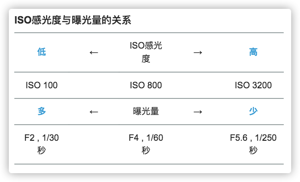
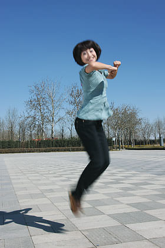
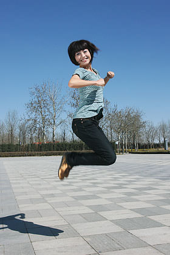
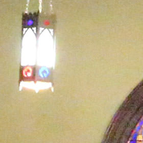

## ISO

ISO即感光度，其概念是从传统胶片感光度引入的，是指用一个具体的感光度数值来表示感光元件对光线的敏感程度, ISO越大表示sensor 对光线越敏感。目前的数码相机使用了相同的感光度测定标准，但表示的已经不是感光元件对光线的敏感程度（目前相机都是通过光敏元件来感光，相机生产，感光能力就固定了），而是整个相机对光信号的放大能力。数码相机利用不同的放大倍率，提供一种类似于不同胶片感光度的功能。

ISO是InternationalOrganization for Standardization的缩写，是国际标准化组织的英文简称。在胶片时代，该组织定义了胶片的感光度的测量标准，被称为ISO感光度，有ISO 100、ISO 400等种类。为了便于工业化生产和消费者使用，数码相机使用的是与胶片速度一样的感光度测定标准——ISO 12232。ISO感光度测量标准综合了DIN系统的对数标度和ASA系统的算术标度，比如ISO 100/21°和ISO 200/24°，后者的感光度是前者的两倍。后来，人们通常习惯把后面的对数标度省略不写，于是便成了我们现在经常在相机和手机中看到的ISO值。

#### 胶片感光度
在胶片时代，胶片对光子的记录能力取决于其表面的感光乳剂，主要成分为溴化银（AgBr）、氯化银（AgCl）和碘化银（AgI） 等一类卤化银物质。它们遇光后会发生化学反应，银离子变成了金属银附着于胶片表面，然后经过显影、定影、冲洗和晾晒等暗房处理，便完成了一张照片的冲洗。
卤化银的颗粒大小决定了胶片的感光能力：颗粒越大，单位时间内发生化学反应的概率也就越大，所谓的「胶片速度」（即感光度）也就越高。因此，高感胶片（比如：高于ISO400）也称为「快胶片」（fast film）。
影响胶片敏感度的因素可以有很多，如胶片厂商（类型）、工艺化学（污染、温度、时间等）和曝光条件（时长、光线波长）等。
为了使得不同厂商的胶片能够对比，ISO组织定义了胶片感光度测量标准，使得不同生产厂家，工艺流程，材料制作的胶片可以横向对比。

#### 数码相机感光度

到了数码相机时代，我们依然沿用了感光度这次术语，但其实已经不再是物理意义上的感光度，因为数码相机的「感光能力」或者「对光的敏感度」由光敏传感器决定，它在出厂封装后便已是固定不变，与ISO值无关。

ISO 组织定义了4种对数码相机系统感光速度测定方式：
* 基于饱和度的感光速度
* 基于噪声的感光速度
* 标准输出敏感度（SOS）
* 和推荐曝光指数（REI）

每种计算方式都不太一样， 但是基本都反映了相机系统接受光子输出信号的强度。

#### 数码相机的ISO
上面说了，ISO值与数码相机的「感光能力」无关，**那么对于数码相机ISO不同意味着什么？**
**相机固定不变的情况下，调节ISO 其实本质就是调节信号的放大倍数。** 光信号进入镜头后，传感器上发生光电效应后转化为电信号（电压值），此时还是一种模拟信号，电路对这个模拟信号进行放大（模拟增益），然后送入模数信号转换器（ADC）转为数字信号，后面的所有处理都是在数字表示的图像上进行，数字图像处理过程中还可能对图像信号进行放大，这一步叫数字增益。naively,我们可以用模拟增益和数字增益来控制ISO,高级的相机肯定还有更多的控制。通过ISO的控制，我们可以在曝光量不变的情况下，使得输出信号变强，仿佛达到了曝光量更大的效果。比如在不过曝的场景中，拍摄一张图像，调节光圈为1/2, ISO变为2倍， 那么可以获得几乎（注意是几乎）相同的成像效果。

目前相机的支持的ISO 范围非常广，一般范围ISO50~ISO12800， 不同相机范围不同，也有部分相机可以支持更大的ISO

#### ISO 与成像
下图表示ISO感光度与曝光的关系。曝光量由光圈与快门速度的组合决定。使用高ISO感光度时曝光量减少，低ISO感光度时曝光量增加。

##### 暗光场景
ISO 越高，相机对单位曝光的输出信号就越强，因此在拍摄暗光场景的时候可以调高ISO(当然，也可以选择更长的快门时间，在没有三脚架的情况下可能会因为拍摄抖动导致画面模糊).下图是高ISO 感光度拍摄的示例
以高速快门定格演奏者的示例。为了不破坏气氛没有使用闪光灯，这是高ISO感光度才能拍下的暗光场景效果。手动曝光（F4，1/800秒）／ISO 6400

##### 运动场景
运动场景因为物体运动很快，因此开门时间越长拍摄的运动模糊越严重，此时可以调小快门时间，调大ISO, 在保证成像质量的同时，减小运动模糊的程度。如下，是不同快门/ISO 下拍摄的两幅图像，成像质量相近，但运动模糊程度不同

ISO 200，快门速度1/50秒拍摄示例

ISO 800，快门速度1/200秒拍摄示例

##### ISO与成像关系
1.ISO越低照片越暗，ISO越高照片越亮。
2.ISO越低噪点越少，ISO越高噪点越多
真实拍摄场景，在能够拍清楚目标的情况下，尽量选择最小的ISO, 通过延长曝光时间来保证曝光量。
### 提高ISO 的缺点
因为目前相机对ISO 的调整本质上是调整了对信号的放大倍数，因此对于成像过程中的噪声也会同等比例的放大，ISO 越大这部分噪声放大的越明显。下图展示了不同ISO 下的成像效果

iso100

iso25600

###
###### reference
* https://www.canon.com.cn/special/ds_abcbook/intermediate05.html
* https://zhuanlan.zhihu.com/p/112605651