## ISP

### 什么是ISP
ISP(Image Signal Processor)，即图像信号处理器，用于处理图像信号传感器输出的图像信号。它在相机系统中占有核心主导的地位，是构成相机的重要设备。它将传感器得到的信号进行处理得到可视图像

### ISP 在计算机视觉处理中的位置
一个典型的计算机视觉处理流程如下图，其中ISP在成像引擎部分
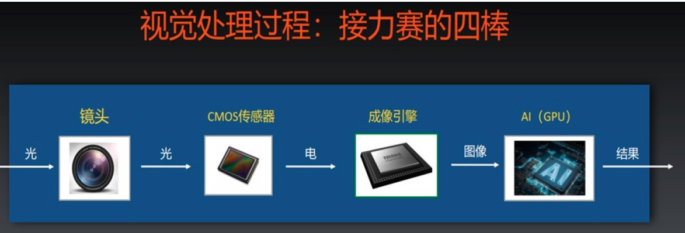

### 需要ISP 的原因
1. 镜头和Sensor的物理缺陷
2. 拍摄的光线条件多样，镜头和Sensor需要根据环境做适应

### sensor的问题&ISP的处理原理

#### 问题1：sensor 有暗电流

##### 问题描述
暗电流指在没有光照射的状态下,在太阳电池、光敏二极管、光导电元件、光电管等的受光元件中流动的电流。因此相机sensor 在完全无光照的情况下输出的电压不为0，因为会有不为0的灰度值输出。但我们希望全黑时输出的灰度值为全0

##### ISP 处理原理
* 找到一个矫正值，所有像素值都减去这个值，就得到一个矫正成功的结果。
* 一般情况下，sensor的传感器周边，还有一小部分区域是有感光器的，但是没有光透射进来。可以把这部分的传感器的信号作为矫正值，从可感光部分的信号中减去，就可获得校正后信号。

##### ISP 处理模块
* BLC(BlackLevel Correction) 黑电平校正
* 方法成熟，效果较好

##### 处理效果

#### 问题2：Lens shading

##### 问题描述
Lens Shading可细分为Luma Shading（亮度均匀性）和Color Shading（色彩均匀性）两种。其中，Luma Shading就是我们常说的暗角。即图像呈现出中心区域较亮，四周偏暗的现象。Color Shading则表现在图像中心区域与四周颜色不一致。即图像的中心区域或者四周出现偏色。
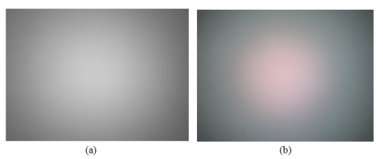

##### Luma shading 成因
1. 由摄像头本身的机械结构导致产生。由于摄像头各模块在制作和组装的过程中，均存在一定的工艺误差，从而影响物体光线在摄像头内的传播。
2. 由镜头（Lens）的光学特性引起。对于整个镜头，可将其视为一个凸透镜。由于凸透镜中心的聚光能力远大于其边缘，从而导致Sensor中心的光线强度大于四周。此种现象也称之为边缘光照度衰减。对于一个没有畸变的摄像头，图像四周的光照度衰减遵循$cos^4\theta$的衰减规律。在考虑镜头构造和畸变的影响时，图像四周的光照度衰减可能不再遵循$cos^4\theta$的衰减规律。

##### Color shading 成因
1. 红外截止滤波片(IR-Cut filter)
由于图像传感器上的RGB像素滤波片不能滤除红外光和紫外光，因此需要使用另外的滤波片进行滤除，否则会导致红绿蓝像素点的亮度值与人眼观察到的亮度值存在较大的差异。因此引入了红外截止滤光片，红外截止滤波片位于镜头和图像传感器之间。主要用于消除投射到Sensor上不必要的光线，防止Sensor产生伪色/波纹，从而提高色彩还原性。就目前而言，红外截止滤波片可分为干涉型、吸收型和混合型三种，其三者的截取范围如图红外截止滤波片截取区域如下图（左）所示。其中普通的红外截止滤波片为干涉型红外截止滤波片，在可见光区域有较高的透过率，存在较低反射率，而在红外区域正好相反，反射率较高，透过率很低。但成角度拍摄照片时，红外光在IR膜上会有较大反射，经过多次反射后，被Sensor接收从而改变图像R通道的值，引起图像偏色问题。蓝玻璃则是吸收型红外截止滤波片，对红外光有很强的吸收作用，不存在很大的反射，能在一定程度上减轻渐晕和色差问题。此外，便是使用前两者混合的方式对想要的光谱区域进行截取，虽然能够缓解入射光角度问题，但使得抵达传感器的光量减少了，从而引入了更多的噪声。如下图（右）所示。其次，在红外截止滤波片之后便是图像传感器，主要由相间的RGB像素感光块构成。为了使感光面积不受感光片的开口面积影响，一般会在其上方增加一层微透镜（Micro Lens），用于收集光线，提高感光度。但微透镜的主光线角CRA（Chief ray angle）值与镜头的CRA值不匹配便会导致严重的shading问题。

2. 由于镜头对不同光谱光线的折射程度不同，导致入射光线中不同波长的光线落在Sensor的不同位置，从而引起Color Shading。我们都知道光的色散现象，即白光通过三棱镜后会被分解为七色光。而产生这种现象的原因就是三棱镜对不同波长光线的折射不同，从而导致不同波长光线走过的光程不同。
3. 由Sensor上微透镜的CRA与镜头的CRA不匹配导致。镜头的主光线角与传感器不匹配，会使传感器的像素出现在光检测区域周围，致使像素曝光不足，亮度不够。
4. 在校正Lens Shading时，由于校正参数计算不准确导致。

##### 处理原理
1. 首先检测出图像中间亮度比较均匀的部分，认为这部分不需要矫正，然后以此为中心，计算出周围区域需要补偿的因子（增益）。实际项目中，可以把镜头对准白色物体，检查图像四周是否有暗角。

##### ISP 处理模块
* LSC(Lens Shade Correction) 镜头阴影校正
* 方法成熟，效果较好

##### 处理效果
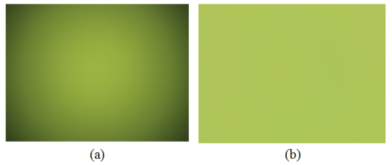

#### 问题3：像素点有坏点

##### 问题描述
由于Sensor是物理器件，有坏点是难以避免的；而且使用时间长了坏点会越来越多。通过在全黑环境下观察输出的彩点和亮点，或在白色物体下观察输出的彩点和黑点，就可以看到无规律的散落在各处的坏点
##### ISP处理原理
1. 检测坏点。在RGB域上做5x5的评估，如果某个点和周围的点偏离度超过阈值的点为坏点。为了防止误判，还需要更复杂的逻辑，如连续评估N帧。

2. 纠正坏点。对找到的坏点做中值滤波，替换原来的值即可

##### ISP 处理模块
* BPC(Bad Point Correction)------坏点校正
* Defect Pixel Correction(DPC)

##### 处理效果
* 无图

#### 问题4：Cmos的Sensor采用了Bayer色彩滤波阵列(Bayer Color Filter Array，CFA)
##### 问题描述
按道理sensor输出的是RGB的raw data，每个像素点都感知RGB 3个分量的数字这样最准确。但是这样需要3套感光板，而且RGB的3套数据还需要时间同步和对齐，这样成本高，难度大。所以，我们通常采用一个叫Bayer色彩滤波阵列(Bayer Color Filter Array，CFA)的滤光板，放在一个感光板。
如下图是一个8x8的分辨率的感光面板，
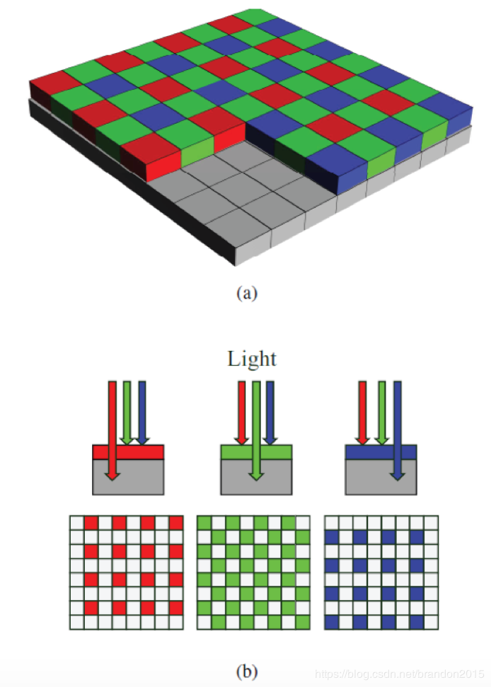
图(a)中彩色部分是Bayer色彩滤波阵列，RGB三种颜色间隔排列。这样一次拍照就产生图(b)的RGB三幅图片，图片中彩色的是有感光数字的，白色空白是没有感光数字的点。我们需要通过Demosaic（颜色插值）的方法，把白色的像素点的值给补上。图(b)绿色的像素点数目是红色或蓝色的2倍，是因为人员对绿色更敏感。
注：Bayer色彩滤波阵列并不是唯一选择，他只是柯达公司科学家Bayer发明的。华为P30pro夜间拍摄牛逼，用到了RYYB的滤镜阵列设计，RYYB就是将两个绿色像素（G）换成黄色像素（Y）替代, Y(红色和绿色组合)。

##### ISP 处理原理
为了填充上图（b)中三个颜色通道白色（没有值）像素点的数值，可以利用插值的思想来对其进行填充。过程如下图：
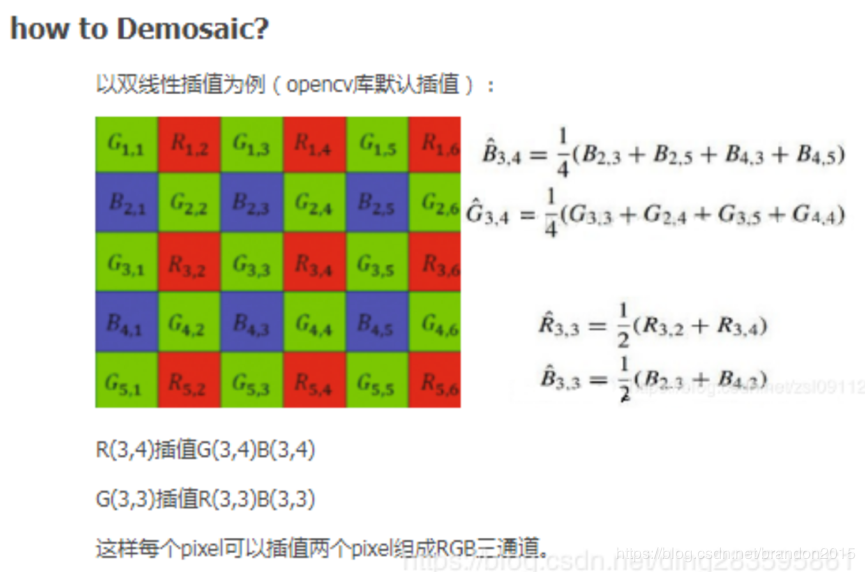
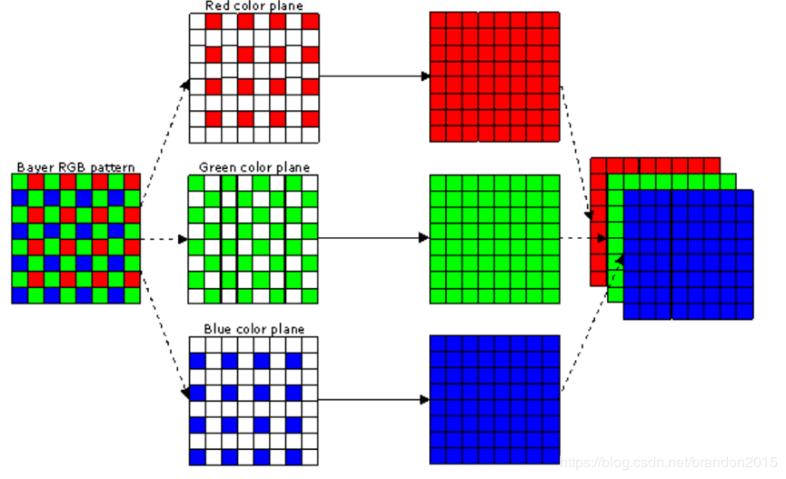

##### ISP 处理模块
* Demosaic 颜色插值
* 处理方法比较成熟

##### 处理效果
* 

#### 问题5：Senor获取的图像中有大量噪声

##### 问题描述
成像过程中会引入很多噪声：
   1. 光子具有不确定性，因此不同像素上接受原始的光子数目会有噪声
   2. 电子电路设计会有不可避免的噪声，读取电压会有噪声
   2. 电路暗电流不稳定，会产生噪声
   4. ADC 转换会一如噪声
这些噪声最终会反映在最终成像的图像上。

##### ISP 处理原理
对图像进行降噪处理。传统方法有均值滤波、高斯滤波，本质是低通滤波器。普通的高斯滤波只考虑像素的空间距离关系，这样会导致滤波后图像变得模糊，为了避免图像变模糊，就需要保持图像的边缘，这时，就还要考虑相邻像素和本像素的相似程度，对于相似度高的像素给予更高的权重，我们称这种滤波为双边滤波。

##### ISP 处理模块
* Bayer Denoise-----去除噪声
* 算法较为成熟

##### ISP 处理效果
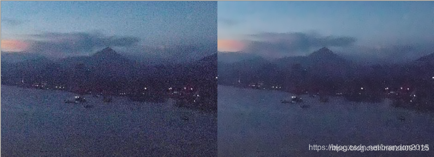

#### 问题6：Senor获取的图像容易受到光源颜色的影响
##### 问题描述
人眼成像有一个视觉修正效果，不论是在晴天，阴天，白炽灯或者日光灯下面，人眼看到的白色总是白色。（尽管此时物理上，物体反射的光不是白色）这是因为人脑对物体的颜色有一定的先验知识，会进行修正这种色差。但sensor 并不如人脑智能，sensor 只是如实的记录物理上物体的反射光。在不同光线下，Sensor输出的是不同颜色，在低色温下偏黄，在高色温下偏蓝。如白炽灯照明下拍出的照片易偏黄；而在户外日光充足则拍摄出来景物也会偏蓝。因此为了接近人眼的感受（或者成像的好看），我们需要让不同色温条件下拍摄的物体颜色，输出颜色都更接近其在真实世界的颜色，i.e, 不同色温条件下的白色物体（此时sensor记录的颜色是不一致的），输出都为真实的白色。

##### ISP 处理原理
比较常用的WEB算法有灰度世界、完美反射法等。
灰度世界（Gray World）算法基于一个假设：平均来讲，世界是灰色的。所以，白平衡就是调整R/B增益，达到R、G、B 相等。
白平衡有3个步骤：

1. 检测色温，如果手工调节，就知道图像中什么位置是白色物体了，色温容易检测；如果是自动调节，就需要估计出（猜出）图像中的白色位置，这是最重要的一环；实际计算中为了实时操作，减少计算量，通常选取某个特定区域(如图像中央)像素进行计算。但若图像颜色较为单一或选定区域正好落入大的色块（红光下的白墙），以上算法求得的色温会非常不准确。为此，必须根据一定的约束条件，挑选出白色像素来计算色差。

2. 计算增益，计算R和B要调整的增益；调整增益将Cb和Cr调整到0 (或接近0)的两个系数，即R=G=B。

3. 色温矫正，根据增益调整整幅图片的色温。

##### ISP 处理模块
* AWB（Automatic White Balance）自动白平衡

##### ISP 处理效果

#### 问题7：Senor滤光板处各颜色块之间的颜色渗透带来的颜色误差。

##### 问题描述
Sensor图像传感器获取的图像，与人眼感受的颜色有一定的偏差。之所以有差距，是因为sensor成像的颜色匹配特性通常不满足卢瑟条件（也就是说sensor的RGB响应通常不是线性无关的），换言之，相机的颜色匹配特性与CIE标准观察者之间并不存在线性关系(sensor 对颜色的响应与人眼的响应不一致），因此，我们需要某种方法来校正相机的特性，使其接近标准观察者。除此之外滤光片无法做到理想过滤效果（会透过一部分其他颜色光线）使得sensor感应不符合

##### ISP 处理原理
颜色校正矩阵。拍摄color checker24色板，将相机拍摄图片值与色板标准值之间进行对比（RGB颜色空间），得出一组能将拍摄值校正到最接近标准值的3x3矩阵。通过这个矩阵对所有相机拍摄的图片进行颜色校正。

##### ISP 处理效果
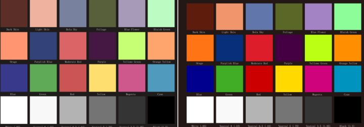

#### 问题8：人眼对暗部细节比Sensor敏感

##### 问题描述
人眼不同于摄像机，接收光子来感知光线。比如：在一间小黑屋中每增加一盏灯，摄像机都能线性增加亮度。但是人眼在黑暗时增加一盏灯时感受明显，往后随着灯的个数增长人眼并不会有明显感受。如果将实验做成图表，如下图所示，蓝色为人眼，紫色为摄像机。
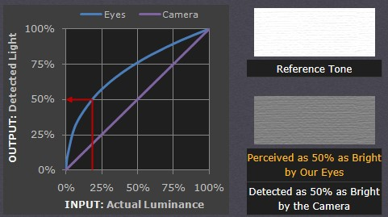

##### ISP 处理原理
Gamma编码后的图像相比于线性编码的图像，明显有更多的暗部色阶。Gamma编码刚好满足了人眼对暗部细节敏感的特性。即人眼是按照gamma < 1的曲线对输入图像进行处理的（公式$f(I)=I^{gamma}$，I为原图像素值）

##### ISP 处理模块
* Gamma Correction 伽马校正

##### ISP 处理效果
左图为原图，中图为gamma = 1/2.2在校正结果，右图为gamma = 2.2的校正结果

#### 问题9：Senor的输出的Raw data是RGB，但是有的处理在YUV上更方便，且YUV存储和传输时更省带宽
##### 问题描述
存储，传输，处理过程中YUV 是一种更理想的格式

##### ISP处理原理
YUV 是一种基本色彩空间， 人眼对亮度Y改变的敏感性远比对色彩变化大很多， 因此， 对于人眼而言， 亮度分量Y 要比色度分量U、V 重要得多。所以，只有YUV444格式的YUV数据的比例是1:1:1，其他各种格式，如YUV422，YUV420等格式，UV的数据量都小于Y，达到节省存储空间和传输带宽的目的。

##### ISP 处理模块
* RGBBtoYUV 色彩空间转换

##### ISP 处理效果
* 处理前后视觉无差别

#### 问题10：Senor一定曝光量下较暗部分或较亮部分的细节显示不充分

###### 问题描述
自然界的中光强度很宽，而人眼对高亮，极暗环境的细节分辨能力相对较窄，而摄像头记录的范围更窄，真正的HDR技术就是记录视觉范围内高亮，极暗环境的中的细节分辨率。
为保证人眼看到的世界和显示器或者摄像头采集的图像的亮度范围相差无几，甚至更好，需要通过tone mapping，将暗处和亮出细节再现。这是一种纯粹为了视觉感受而进行的处理，并非真正的HDR。也有人称为WDR（Wide Dynamic Range）。简而言之，宽动态技术可以使场景中特别亮的区域和特别暗的区域在最终成像中同时看清楚。

##### ISP 处理原理
主要是通过tone mapping的方法，将像素值在特别暗的区域拉高，在特别亮的区域拉低。
Tone mapping有以下几种：
1. global tone mapping
   1. 单一tone mapping曲线。对整幅图低拉高，高拉低。（缺点，蒙上一层雾感觉，因为数值压缩后忘中间靠拢，局部对比度下降）
   2. 双边滤波tone mapping。在图像中局部边缘处不会进行tone mapping，以保持局部细节。

2. local tone mapping
   1. 虚拟曝光。通过多帧相加确定哪些区域是高亮区，哪些区域是低亮区。然后分区进行local tone mapping
   2. local gamma。图片分成多块，对每块进行gamma矫正。主要根据每块的亮度直方图进行动态调整gamma曲线

##### ISP 处理模块
* HDR（High-Dynamic Range）------高动态范围

##### ISP 处理效果
* 无

#### 问题11：YUV色彩空间需要进一步降噪和锐化

##### 问题描述
为了成像质量，需要对yuv降噪处理，同时为了消除降噪过程中对图像细节的损失，需要对图像进行锐化处理，还原图像的相关细节。因为在YUV色彩空间，这些处理更方便。

##### ISP 处理原理
为了抑制图像的彩色噪声， 一般采用低通滤波器进行处理。 例如使用M×N的高斯低通滤波器在色度通道上进行处理。
在YUV 色彩空间上彩噪去除与边缘加强、色彩与对比度加强，中间还要进行自动曝光控制等， 然后输出YUV（或者RGB） 格式的数据， 再通过I/O 接口传输到CPU 中处理

##### ISP 处理模块
* color denoise/sharpness

##### ISP 处理效果
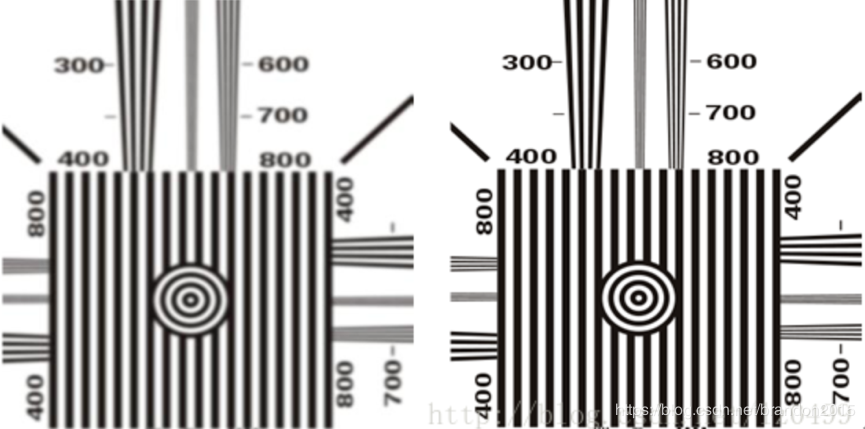

#### 问题12：图像传感器和镜头需要ISP模块根据光强度自动调节曝光时间

##### 问题描述
不同场景下，光照的强度有着很大的差别。人眼有着自适应的能力因此可以很快的调整，使自己可以感应到合适的亮度。而图像传感器却不具有这种自适应能力，因此必须使用自动曝光功能来确保拍摄的照片获得准确的曝光从而具有合适的亮度。

##### ISP 处理原理
自动曝光的实现一般包括三个步骤：
1. 光强测量。光强测量的过程是利用图像的曝光信息来获得当前光照信息的过程。可以统计图像的全部像素，也可以统计图像中间部分、也可以将图像分成不同部分且每部分赋予不同权重。
2. 场景分析。场景分析是指为了获得当前光照的特殊情况而进行的处理，比如有没有背光照射或者正面强光等场景下。对这些信息的分析，可以提升图像传感器的易用性，并且能大幅度提高图像的质量，这是自动曝光中最为关键的技术。目前常用的场景分析的技术主要有模糊逻辑和人工神经网络算法。这些算法比起固定分区测光算法具有更高的可靠性，主要是因为在模糊规则制定或者神经网络的训练过程中已经考虑了各种不同光照条件。
3. 曝光补偿。在完成了光强测量和场景分析之后，就要控制相应的参数使得曝光调节生效。主要是通过设定曝光时间和曝光增益来实现的。

##### ISP 处理模块
* AEC( Automatic Exposure Control) 自动曝光

##### ISP 处理效果
* 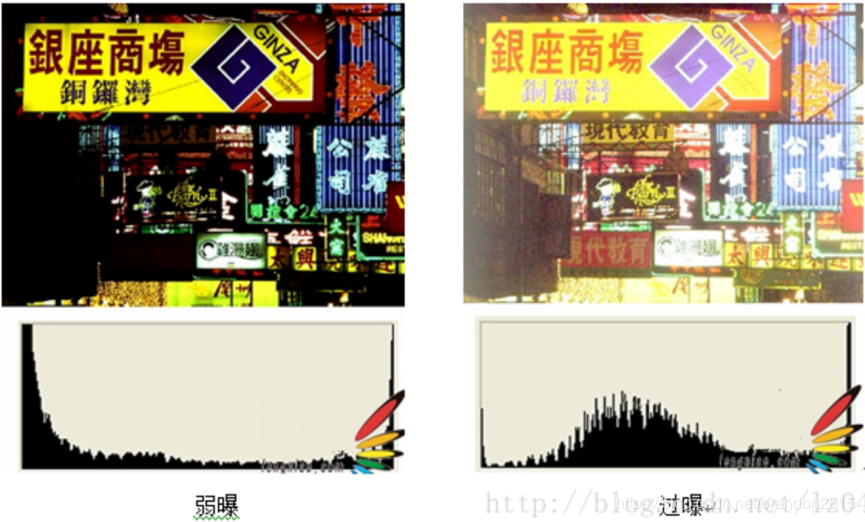

#### 问题13：变焦镜头需要自动调节焦距

##### 问题描述
相机成像最清晰的是焦距出的物体，但实际生活中需要拍的对象不一定刚好在焦距附近，因此会有拍摄模糊的情况。人眼晶状体可以自动调焦。对于可变焦镜头，需要自动对焦。

##### ISP 处理原理
AF算法的基本步骤是先判断图像的模糊程度，通过合适的模糊度评价函数求得采集的每一副图像的评价值, 然后通过搜索算法得到一系列评价值的峰值, 最后通过电机驱动将采集设备调节到峰值所在的位置, 得到最清晰的图像。
对焦评价函数
评价函数有很多种, 主要考虑的图像因素有图像频率(清晰的图像纹理多, 高频分布较多), 还有图像的灰度分量的分布(图像对应的灰度图的分量分布范围越大,说明图像的细节较多, 反应的图像的清晰程度)
常用的搜索算法有爬山算法, 搜索窗口有黄金分割点对焦嵌套窗口等.

##### ISP 处理模块
* AF( Automatic Focus) 自动对焦

##### ISP 处理效果
* 打开你的手机体验一下
