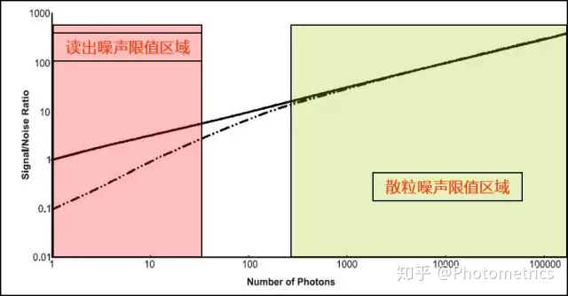

# 相机成像过程
## 基本概念
  * 噪声：噪声是围绕着信号上下波动的不确定性，从统计学上来说，就是标准差。
  * 信噪比： 信号与噪声的比值
  $$ SNR = \frac {signal*QE} {\sqrt {signal*QE + 暗电流*t + 读出噪声^{2}}} $$

## 噪声类型
  * 散粒噪声
  * 读出噪声
     * 就是相机在读出信号时产生的噪声，是电子通过前置放大器和模-数转换器（ADC）转换为数字信号时引入的不确定性。CCD / EMCCD和sCMOS相机由于传感器的信号读出结构不同，读出噪声也有很大差别。sCMOS相机的读出噪声远低于CCD/EMCCD。
     * 读出噪声受读出频率影响，频率越高，读出噪声就越高
     * 读出噪声低好处多多，首先它让我们能够检测非常微弱的信号，使其不至于被淹没在读出噪声中。尤其是在弱光高速成像中，其他噪声的影响很小，读出噪声定义了相机的探测下限。同时，低的读出噪声还能增加图像的有效动态范围，提高对比度。要降低读出噪声，可以通过改进相机的电子设计或降低读出速度来实现。
  * 暗电流
     * 暗电流是随时间累积的
     * 所以制冷是降低暗电流的主要措施
     * 相机最常用的制冷方法是热电冷却，又称珀尔帖冷却 (Peltier cooling)，即由和传感器相连的散热器进行散热。一般来说，芯片温度每降低7°C，暗电流减半。
     * 热点（Hot pixel），它们也是暗电流的一部分，是由于某些像素电荷泄露引起的。Hot pixel亮度也会随着曝光时间增加而累积。不过好在这些Hot pixel的位置是固定的，因此可以通过一些算法将它们去掉

## 对比度
   1. 检查对比度最亮灰度是否设置得过大，导致小灰度值显示过暗；
   2. 背景噪音一般比信号弱很多，适当将对比度最暗灰度调大，使背景噪音消失不见；

## EQ 
   * 量子效率
   * QE很容易理解，就是探测器的探测效率。由于半导体材料对光信号的吸收效率和波长相关，我们看到的QE曲线横轴为波长，纵轴为百分比。
   * 
   * 光在半导体材料中的穿透性和波长相关。500~600nm的黄绿色光，正好能穿透到检测材料的中间，所以检测效率最高。波长变短时，越多光子在到达检测区前就被吸收；波长变长时，越多光子会穿过检测区，或因为能量不足，无法生成光电子。所以我们看到的QE曲线是中间高，两侧降低的。
   * 相机的QE和读出噪声决定了相机从读出噪声限制区域到散粒噪声限制区域过度的早晚；
   * 
## ADU(灰度值)
   * 硅材料（或者其他材料）能够将接收到的光子转换成电子
   * 转换成的数字信号我们称之为模拟数字单位（ADU）
   * 做图像处理的工程师们更常把ADU称之为灰度值（Gray Scale）
   * 

## 电子数目
### 增益(gain)
   * 电子通过模数转换器（ADC）按照一定的转换系数转换成数字信号，这个转换系数我们称之为增益（Gain）
   * 增益的单位是 e-/ADU
### 偏置（offset)
   * 偏置指每个像素强度的初始值，也就是“相机的底”
   * 如果相机的底是0，向下波动的噪声会产生负值，而相机中不能有负值，于是一部分数据被Cut掉了，影响了数据的真实性，设置一个初始值便能很好的解决这个问题。

### 电子数目计算   
  * **电子数 = （灰度值 – 偏置） X 增益**
  * 增益不会直接影响图片信噪比
  * 信号非常弱时，选取小增益可以提高对比度，增强图像层次感。信号非常强时，选取大增益，可以提高成像的动态范围；