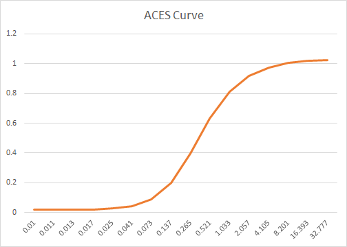

## Tone mapping


首先需要搞清成图像领域动态范围(Dynamic range), 高动态范围（High Dynamic range)和低动态范围（Low Dynamic range)的概念

### 动态范围

Dynamic Range是一种用数学方式来描述某个给定场景的亮度层次范围的技术术语。指图像中所包含的从“最亮”至“最暗”的比值，也就是图像从“最亮”到“最暗”之间灰度划分的等级数；动态范围越大，所能表示的层次越丰富，所包含的色彩空间也越广。最通常的解释有两种：

* (1)一种是摄影界通常所说的D值（以对数值表示的场景最高亮度和最低亮度比的相对数值），通常由0-4之间的很精确的数字来表示。D值的计算公式为：Dynamic Range=log10(Max Intensity / Min Intensity)。公式中intensity是指光照强度，我们对最大亮度除以最低亮度的结果取对数，得到的结果就是动态范围的相对数值——摄影界所说的D值。各种景物、底片和照片都有其各自特定的D值范围。

* (2)另一种是计算机图形学中通常使用的直接以场景最高亮度和最低亮度的亮度比表述的方法，如255:1。 在数字图像领域一般都采用这第二种比值的表述方式来评述场景的动态范围。亮度的单位以每平方米的烛光来表示（cd/m2）。太阳自身的亮度大约为1,000,000,000 cd/m2。阳光照射下的景物的亮度可达100,000 cd/m2，而星光的亮度大约在0.001 cd/m2以下，二者亮度比达亿倍以上。现实中人类的眼睛所能看到亮度比的范围是 $10^5$ 左右，

#### HDR
* 高动态范围，此处的高没有精确的定义，动态范围相对较大的可以称之为高动态范围，相比于显示器的255：1 的动态范围，目前支持HDR 的手机和摄影设备可以生成HDR图像，可以称为高动态。

#### LDR
* 什么是LDR？它所采用的色彩模型是目前通用的图像描述模型——RGB模型。每种色彩都可以用三原色（红、绿、蓝）加上适当的亮度来表示，三原色的亮度梯度各为256级。选定每色256级是在电脑硬件性能、照片级真彩图片需要和电脑2进制方案综合考虑后的结果。这就是目前我们非常熟习的观看、编辑、交换和处理数字图像的软硬件环境。这种8比特位元RGB低动态范围图像描述模型是将场景最高亮度和最低亮度的亮度比限定为255比1，计算得出的动态范围D值即为2.4。


### Tone mapping
采用HDR渲染出来的亮度值会超过显示器能够显示最大值，此时我们需要将光照结果从HDR转换为显示器能够正常显示的LDR，这一过程我们通常称之为Tone Mapping。用Tone mapping压缩以后，我们所得到的HDR影像就能很好地在显示器上显示了。下图是对采用HDR渲染的图片使用了Tone Mapping和没有使用Tone Mapping的对比结果：


其中，上图是没有使用Tone Mapping的结果，下图是使用了Tone Mapping的结果。可以看到，在没有使用Tone Mapping的渲染结果中，有很大一部分像素的光亮度是超过了显示器能够显示的最大值。在视觉上，这些地方变得过曝了。而在使用了Tone Mapping的渲染结果中，像素光亮度变得正常，视觉上也更加真实。

目前 Tone mapping 主要采取ACES，它是一套颜色编码系统，或者说是一个新的颜色空间。它是一个通用的数据交换格式，一方面可以不同的输入设备转成ACES，另一方面可以把ACES在不同的显示设备上正确显示。不管你是LDR，还是HDR，都可以在ACES里表达出来。这就直接解决了VDR的问题，不同设备间都可以互通数据。下面是AECS的表达式：
```
float3 ACESToneMapping(float3 color, float adapted_lum) 
{ 	
       const float A = 2.51f; 	
       const float B = 0.03f; 	
       const float C = 2.43f; 	
       const float D = 0.59f; 	
       const float E = 0.14f;  	
       return (color * (A * color + B)) / (color * (C * color + D) + E); 
}
```
曲线如下图：

由映射曲线可以看出，在做映射时，较小和较大的color映射到相对较小的范围，而中间强度的颜色值获得比较大的范围区间，这样使得显示场景暗的地方不至于太暗，亮的地方不至于过曝。通过这条tone mapping 曲线我们就可以将HDR亮度值转换到[0,1]，然后乘以255，就转到了我们LDR设备的显示区域[0,255]了。当然在转到[0,255]之前，我们还需要做另外一个操作——Gamma Correction。

总的来说，Tone Mapping和Gamma Correction二者都是为了更好的在LDR设备上显示图片，将图片的颜色值从一个范围分布变换到另一个范围分布。而不同的是，Tone Mapping是根据相应的算法将颜色值从一个大的范围映射到了较小的范围，而Gamma Correction则是从[0,1]映射到[0,1],映射范围并没有改变，只是改变了不同亮度值颜色的分布情况。这两种变换需求的本质是由于我们的LDR设置只支持8位的颜色值造成的，如果有一天我们的显示设备支持16位或者更高位的颜色值，也许它们就可以退出了

